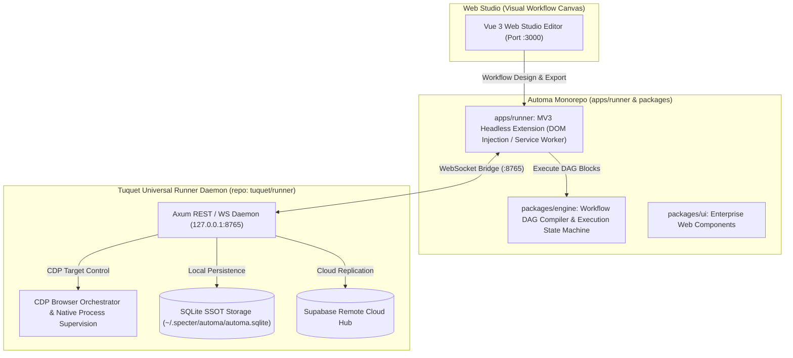

<div align="center">
  
  <h1>Automa</h1>
  <p><strong>Next-Generation Workflow Orchestration &amp; Headless Automation Platform</strong></p>

  <p>
    <a href="https://github.com/tuquet/scoop-bucket"></a>
    <a href="https://github.com/tuquet/automa/releases"></a>
    <a href="https://www.rust-lang.org/"></a>
    <a href="https://nodejs.org/"></a>
    <a href="LICENSE"></a>
  </p>
</div>

<br/>

Welcome to **Automa**, an open-source, high-performance browser automation & OS orchestration platform. Built as a streamlined monorepo, Automa pairs an extensible **Workflow Engine DAG (`packages/engine`)** with a lightweight **Manifest V3 Headless Chrome Extension Runner (`apps/runner`)**, supervised by the native **Tuquet Runner** daemon (`runner`) and **Tuquet CLI** (`cli`).

---

## ⚡ Why Automa?

Modern web automation requires a delicate balance between ease of use, execution speed, and account safety. Automa solves this with a hybrid architecture:

| Automation Challenge | The Automa Solution | Business Outcome |
| :--- | :--- | :--- |
| **Complex Automation Coding**<br/>Traditional tools require software engineers to write and maintain brittle automation scripts. | **Visual Node-Graph Web Studio**<br/>Intuitive drag-and-drop workflow canvas allows non-technical operators to build and test automation flows visually. | **10x Faster Workflow Creation**<br/>Empower operations teams to build and modify automations without engineering bottlenecks. |
| **High Memory & Fragile Node Daemons**<br/>Running multiple Electron or Node.js browser runners exhausts workstation CPU and memory. | **Lightweight Rust Native Engine**<br/>Native Axum daemon compiled directly for Windows/Linux with near-zero memory footprint and raw CDP speed. | **Maximum Workstation Density**<br/>Run multiple concurrent automation tasks smoothly on standard hardware. |
| **Browser Fingerprint & Identity Leaks**<br/>Using personal host browsers leaks cookies, extensions, and hardware IDs across accounts. | **Isolated Standalone Chromium Runtimes**<br/>Dedicated Chromium binaries managed in isolated directories ensure zero identity bleed between accounts. | **Enterprise Account Safety**<br/>Protect critical multi-account workflows against bans and fingerprint correlation. |
| **Vendor Lock-in & Cloud Latency**<br/>Pure cloud automation platforms introduce network lag and risk business halt during outages. | **Offline-First with Seamless Cloud Sync**<br/>Executes reliably against local SQLite storage, with optional turnkey synchronization to Cloud. | **100% Operational Resilience**<br/>Automations keep running locally even when external network connectivity drops. |

---

## 🧭 Monorepo Structure

```text
tuquet-automa/
├── apps/
│   └── runner/                 # [@automa/runner] MV3 Headless Chrome Extension Runner
├── packages/
│   ├── engine/                 # [@automa/engine] Core Workflow Execution Engine & DAG Compiler
│   ├── types/                  # [@automa/types] OpenAPI Specifications & Shared TypeScript Types
│   ├── ui/                     # [@automa/ui] Enterprise Shadcn Vue UI Primitive Components
│   └── webextension-polyfill/  # WebExtension cross-browser compatibility polyfill
├── diagrams/                   # Interactive Archify Architectural & Pipeline Visualizations
└── docs/                       # Technical Architecture & Deployment Guides
```

> 💡 **Interactive Architecture Artifacts:** Explore the animated [Tuquet Platform Orchestration Pipeline Video](diagrams/tuquet-platform-multi-repository-orchestration-pipeline.webm) and the standalone [Interactive Architecture HTML Viewer](diagrams/runner-automa-pipeline.html) (featuring 5-phase guided tour, infinite trace packet animation, Win32 Job Object supervision, and canonical `~/.specter/` storage).


---

## 🏗️ System Architecture

<div align="center">
  <video src="diagrams/tuquet-platform-multi-repository-orchestration-pipeline.webm" autoplay loop muted playsinline width="100%"></video>
  <p><em>Real-Time Closed-Loop Multi-Repository Orchestration Pipeline: Cloud Command &rarr; Runner Supervisor &rarr; Automa Engine &rarr; Browser Core &rarr; Cloud Event Sync</em></p>
</div>

### System Subsystems & Architecture



---

## 🚀 Quick Start for End Users

There are **two easy ways** to install and run Automa:

### Option 1: Automatic Install via Scoop (Recommended)
If you use [Scoop](https://scoop.sh/):

```console
# 1. Add the official Tuquet Scoop bucket
scoop bucket add tuquet https://github.com/tuquet/scoop-bucket

# 2. Install Tuquet CLI & Automa Extension Runner
scoop install tuquet
# (or install the standalone extension runner: scoop install ext-automa)

# 3. Launch Tuquet Runner Daemon & Automa CLI
tuquet automa
# (or inspect runtime status: tuquet status)

# 4. Auto-update anytime via Scoop
scoop update tuquet
```

---

### Option 2: Direct Binary Download (GitHub Releases)
If you prefer downloading pre-built packages:

1. Go to the **[Latest GitHub Releases](https://github.com/tuquet/automa/releases)** page (or [tuquet/runner releases](https://github.com/tuquet/runner/releases)).
2. Download the latest release package under Assets.
3. Extract the archive to any directory.
4. Run the **`tuquet`** (or **`tuquet-runner`**) executable.

> 💡 **Port Synchronization:** The **Universal Runner daemon** operates locally on port **`8765`** (`http://127.0.0.1:8765` for REST API, WebSocket bridge, and OpenAPI documentation), while the **Web Studio** runs on port **`3000`** (`http://127.0.0.1:3000`). You can inspect CLI options anytime by running `tuquet --help` (or `tuquet automa --help`).

---

## 💻 Developer Monorepo Setup

If you want to contribute or build from source:

### Prerequisites
- **Node.js**: `>= 18.0.0`
- **pnpm**: `>= 9.0.0`

```bash
# 1. Clone repository
git clone https://github.com/tuquet/automa.git
cd automa

# 2. Install dependencies
pnpm install

# 3. Build workspace packages (@automa/runner, @automa/engine, @automa/types, @automa/ui)
pnpm run build

# Build specifically the MV3 headless extension runner:
pnpm run build:runner

# 4. Launch dev mode
pnpm run dev          # Interactive dev orchestrator with TUI service selector
pnpm run dev:all      # Launch all services concurrently
```

---

## 📚 Documentation & Contributing

- 🎨 **[WEB_STUDIO_USER_GUIDE.md](docs/WEB_STUDIO_USER_GUIDE.md)**: End-User manual covering Web Studio screens, tool groups, and step-by-step workflow creation.
- 📖 **[CONTRIBUTING.md](CONTRIBUTING.md)**: Developer guide, coding standards, and PR guidelines.
- 📐 **[WEBE_CHROME_EXTENSION_RUST_ARCHITECTURE.md](docs/WEBE_CHROME_EXTENSION_RUST_ARCHITECTURE.md)**: Deep-dive architecture of Chrome Extension + Rust OS Hybrid Automation.
- 🔒 **[SECURITY.md](SECURITY.md)**: Security policy and vulnerability disclosure process.

---

## 🌐 Ecosystem

Part of the **Automation & Agent Ecosystem**:

- [Automa](https://github.com/tuquet/automa) — Native Chrome/Edge Desktop UI Automation Browser.
- [Runner](https://github.com/tuquet/runner) — High-Performance Distributed Process Supervision Engine in Rust.
- [Browser](https://github.com/tuquet/browser) — High-Performance Headless Web Scraping & Stealth Automation Core.
- [Cloud](https://github.com/tuquet/cloud) — Enterprise Orchestration & Real-time Task Control Plane.
- [CLI](https://github.com/tuquet/cli) — Developer Ergonomic CLI & Unified Command Center.
- [Lib](https://github.com/tuquet/lib) — Monorepo for Shared Enterprise UI & Utilities (`vue-ui`, `vue-table`, `md-export`, `extension-runner`, `lunar`).
- [Scoop Bucket](https://github.com/tuquet/scoop-bucket) — Official Windows Scoop Distribution Channel.

---

## 📄 License

Distributed under the [MIT License](LICENSE).

---

<div align="center">
  <samp>
    <a href="https://tuquet.github.io">Portfolio</a> •
    <a href="https://tuquet.github.io/cv">CV &amp; Resume</a> •
    <a href="https://tuquet.github.io/automa">Automa Studio</a> •
    <a href="https://tuquet.github.io/lib">Component Lab</a> •
    <a href="https://github.com/tuquet/scoop-bucket">Scoop Bucket</a>
  </samp>
</div>
