# Tuquet Platform: Multi-Repository Orchestration Pipeline

This directory contains standalone, interactive visual architecture artifacts for the **Tuquet Ecosystem**, rendered using [Archify v3](https://tt-a1i.github.io/archify/).

---

## 🗺️ Diagrams

### 1. [Tuquet Multi-Repository Orchestration Pipeline](runner-automa-pipeline.html)
- **Source JSON:** [`runner-automa-pipeline.architecture.json`](runner-automa-pipeline.architecture.json)
- **Standalone HTML:** [`runner-automa-pipeline.html`](runner-automa-pipeline.html)
- **Recorded Animation (WebM):** [`tuquet-platform-multi-repository-orchestration-pipeline.webm`](tuquet-platform-multi-repository-orchestration-pipeline.webm)
- **Quality Profile:** `showcase` (100% PASS across Archify Validation, Orthogonal Routing, Specification, and Real-Browser Gates)
- **Visual Style:** `signal-flow` with active pulse packet tracing (`meta.animation: "trace"`) and 5-phase Guided Storyboard Views (`meta.views`).

```mermaid
flowchart LR
    subgraph CloudCtrl["repo: tuquet/cloud (Control)"]
        CloudDispatch["Cloud Dispatcher (WS)"]
    end

    subgraph Runner["repo: tuquet/runner"]
        RunnerHost["Tuquet Runner Host"]
        JobGuard["Win32 Job Object"]
    end

    subgraph Automa["repo: tuquet/automa"]
        AutomaEng["Automa Core Daemon"]
        WorkflowDAG["Workflow Engine DAG"]
        ApiBlock["Workflow API Block"]
    end

    subgraph Browser["repo: tuquet/browser"]
        BrowserEng["Tuquet Browser Core"]
        AntiDetect["Anti-Detect & CDP"]
    end

    subgraph Sandbox["runtime: ~/.tuquet/runtimes/"]
        Chrome["Chromium Runtime"]
    end

    Target["Target Web Platform"]

    subgraph CloudData["repo: tuquet/cloud (Ingest)"]
        CloudIngest[("Cloud Ingestion DB")]
    end

    CloudDispatch -->|"1. push job command"| RunnerHost
    RunnerHost -->|"2. arm Win32 JobObj"| JobGuard
    RunnerHost -->|"3. spawn automa.exe"| AutomaEng
    AutomaEng -->|"compile step DAG"| WorkflowDAG
    AutomaEng -->|"4. request browser"| BrowserEng
    BrowserEng -->|"bind CDP & proxy"| AntiDetect
    BrowserEng -->|"5. launch isolated BSD"| Chrome
    Chrome -->|"6. automate DOM"| Target
    Target -->|"7. extract DOM data"| AntiDetect
    AntiDetect -->|"8. stream CDP events"| WorkflowDAG
    WorkflowDAG -->|"9. trigger API block"| ApiBlock
    ApiBlock -->|"10. POST crawl data"| CloudIngest
    CloudIngest -.->|"11. status update"| CloudDispatch
```

<div align="center">
  <video src="tuquet-platform-multi-repository-orchestration-pipeline.webm" autoplay loop muted playsinline width="100%"></video>
  <p><em>Real-Time Closed-Loop Multi-Repository Orchestration Pipeline: Cloud Command &rarr; Tuquet Runner Supervisor &rarr; Automa Engine &rarr; Browser Core &rarr; Cloud Event Sync</em></p>
</div>




---

## 📦 Multi-Repository Responsibility Matrix

| Repository | Form / Tech | Primary Responsibilities Visualized |
| :--- | :--- | :--- |
| **`tuquet/cloud`** | Supabase (PostgreSQL, Realtime, RLS) | Centralized control plane, `campaign_runs` WebSocket dispatch, and `crawler_data` REST ingestion endpoints. |
| **`tuquet/runner`** | Rust Native Daemon | Host process supervisor, Win32 Job Objects (`0.1ms kill limit`) eliminating orphan Chrome instances. |
| **`tuquet/automa`** | Vue 3 Studio & Axum Engine | Workflow block DAG compiler, DOM automation executor, and `HttpRequestBlock` API trigger. |
| **`tuquet/browser`** | Rust Core Crate (`tuquet-browser`) | Multi-profile user data sandbox, Chromium LTS CDN downloader, and hardware anti-detect spoofer (Canvas, WebGL, proxies). |
| **`~/.tuquet/runtimes/`** | Canonical Storage | Isolated Chromium binaries and dedicated profile storage directory preventing cross-account identity bleed. |

---

## 🛠️ Viewing & Interactive Tour

Open [`runner-automa-pipeline.html`](runner-automa-pipeline.html) in any modern browser or VS Code Live Preview:

### 📺 VS Code Live Preview & Presentation Mode (Infinite Loop):
Open in VS Code Live Preview (`Ctrl+Shift+P` -> `Live Preview: Show Preview`) with URL parameters:
```text
runner-automa-pipeline.html?vscode-livepreview=true&present=1
```
- **`present=1`:** Activates fullscreen Presentation Stage, hides distracting cards, and auto-scales diagram to 100% viewport.
- **`vscode-livepreview=true`:** Optimizes layout and margins for embedded VS Code editor panes.
- **Infinite Loop Animation:** Packet pulses (`archify-edge-flow`) and signal scan beams loop continuously (`infinite`) without stopping or settling!

### 🧭 Features Available:
- **Interactive Guided Tour (`meta.views`):** Use the view switcher in the header to cycle through the 5 multi-repository execution phases:
  - `1. [tuquet/cloud] Job Ingestion`
  - `2. [tuquet/automa] Spawn & DAG`
  - `3. [tuquet/browser] Anti-Detect Launch`
  - `4. DOM Automation & Event Stream`
  - `5. [tuquet/automa -> cloud] Ingestion`
- **Continuous Live Motion:** Real-time animated pulse streams continuously flow across repositories: `tuquet/cloud` $\rightarrow$ `tuquet/runner` $\rightarrow$ `tuquet/automa` $\rightarrow$ `tuquet/browser` $\rightarrow$ `tuquet/cloud`.
- **Exporting:** Click `Export` to generate dual-theme SVGs, 4K full-diagram PNGs, or trace-enabled WebM animations for presentations.

