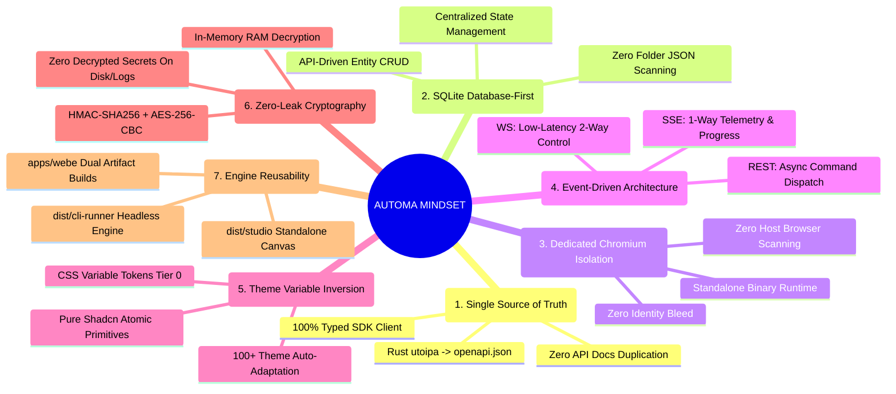
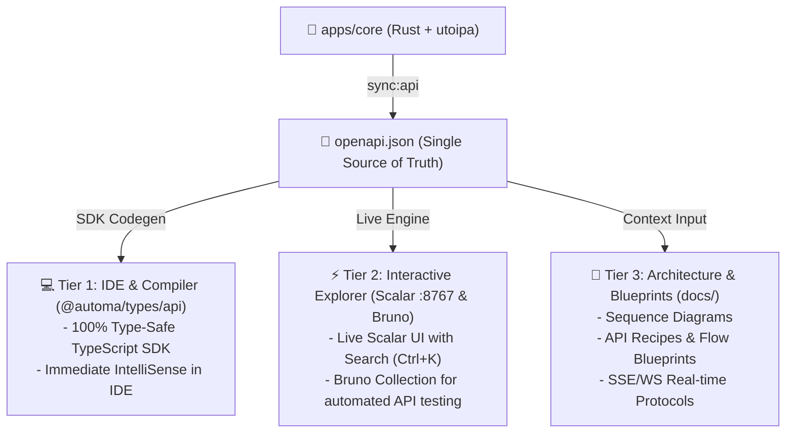

# 📚 Automa Ecosystem Documentation & Knowledge Base (Hub)

Welcome to the comprehensive documentation hub of the **Automa Ecosystem**.

This documentation is governed as a **Living Documentation & Single Source of Truth**, directly connecting our **2D Matrix Specification (2D Matrix SRS)**, **Engineering Guides**, and **Interactive API Reference (Scalar)**.

---

## 🧠 Architectural Mindset & 7 Core Invariants

Code evolves with each commit, but the **Architectural Mindset** and **Core Invariants** provide enduring stability across the ecosystem:



### 💎 The 7 Golden Invariants:

1. **Single Source of Truth & Zero Redundancy**:
   - All API specifications are declared in `apps/core` (Rust + `utoipa`) and compiled to [`openapi.json`](../packages/types/openapi.json).
   - Clients consume endpoints strictly through the generated typed SDK [`@automa/types/api`](../packages/types/README.md).
   - **Principle**: Never duplicate API schemas in static Markdown tables (preventing documentation drift). Explore and test live endpoints via **Scalar API Server** (`:8767`).
2. **Database-First State & Zero Folder Scanning**:
   - **Principle**: Scanning directories for JSON files (`*.workflow.json`, `*.browser.json`) is an anti-pattern causing I/O bottlenecks and race conditions.
   - All domain entities (Workflows, Browsers, Campaigns, Tables, Variables, Credentials) are persisted and queried through the SQLite Database via the Core REST API (`/api/v1/...`).
3. **Dedicated Chromium Runtime & Zero Host Browser Scanning**:
   - **Principle**: Hijacking user host browsers (`chrome.exe`, `msedge.exe`) introduces identity bleed, extension interference, and un-reproducible environments.
   - Automa Core downloads and manages dedicated Chromium LTS binaries, guaranteeing 100% environment isolation and clean session sandboxing.
4. **Event-Driven UI Reactions**:
   - **Principle**: Strict decoupling between **Command Dispatch** and **Observation**:
     - **HTTP REST**: Non-blocking asynchronous command dispatch returning `200 OK (job_id)` immediately.
     - **SSE (`/api/v1/events`)**: 1-way high-throughput telemetry stream (Logs, Progress, State mutations) driving Pinia store reactions.
     - **WebSocket (`/api/v1/ws`)**: Low-latency bi-directional control channel (`PAUSE_JOB`, `RESUME_JOB`, `KILL_JOB`, live breakpoints).
   - Polling endpoints in tight loops is strictly prohibited.
5. **Theme Variable Inversion & Pure Atomic UI**:
   - **Principle**: UI primitives must never contain environment-aware branching (Dark/Light/VS Code).
   - Shadcn-Vue primitives retain semantic classes (`bg-primary`, `border-border`). Cross-platform styling across 100+ VS Code themes, Desktop, and Web is handled at the CSS Variable layer (`tokens.css`).
6. **Zero-Leak RAM-Only Cryptography**:
   - **Principle**: Credentials exist encrypted on disk via `HMAC-SHA256 + AES-256-CBC`.
   - Decryption of `{{secrets.key}}` occurs strictly in-memory during the execution microsecond and is wiped immediately. Plaintext secrets are never written to disk or logs.
7. **Single Core Engine & Dual Reusable Artifacts**:
   - `apps/webe` compiles into two reusable build targets:
     - `dist/cli-runner`: Headless execution engine invoked by the Rust daemon.
     - `dist/studio`: Standalone Web Canvas embedded into VS Code Webviews and Desktop Tauri.
   - Code duplication across execution runtimes and canvas editors is prohibited.

---

## 🏛️ Pillar 1: 2D Matrix Specification System (2D Matrix SRS)

> 📍 **Central Navigation Hub**: [**`docs/srs/README.md`**](./srs/README.md)

```
                       ┌───────────────────────────────────────────────────────────┐
                       │   AUTOMA ECOSYSTEM: 2D MATRIX SPECIFICATION ARCHITECTURE  │
                       └─────────────────────────────┬─────────────────────────────┘
                                                     │
               ┌─────────────────────────────────────┴─────────────────────────────────────┐
               ▼                                                                           ▼
   [ HORIZONTAL TECHNICAL STANDARDS ]                                          [ VERTICAL MENU SPECIFICATIONS ]
   - SRS_HORIZONTAL_BUTTONS.md                                                 - Menu 1: SRS_MENU_STUDIO.md
   - SRS_HORIZONTAL_SELECTS.md                 ◄══ 1-to-1 Matrix Link ══►      - Menu 2: SRS_MENU_BROWSERS.md
   - SRS_HORIZONTAL_FEATURE_STORES.md                                          - Menu 3: SRS_MENU_CAMPAIGN.md
   - SRS_HORIZONTAL_UI_COMPONENTS.md                                           - Menu 4: SRS_MENU_STORAGE.md
                                                                               - Menu 5: SRS_MENU_HISTORY.md
                                                                               - Menu 6: SRS_MENU_SETTINGS.md
```

### 🌐 1. Horizontal Technical Standards
- ⚡ [**SRS Horizontal Buttons & FSM Engine (`docs/srs/SRS_HORIZONTAL_BUTTONS.md`)**](./srs/SRS_HORIZONTAL_BUTTONS.md): Master catalog of 37 Button IDs (`btn.*`), 7-stage FSM lifecycle (`IDLE` $\rightarrow$ `TERMINATING`), 3-tier Browser Waterfall, and WebSocket live breakpoint controls (`PAUSE_JOB`, `RESUME_JOB`, `KILL_JOB`).
- 📜 [**SRS Horizontal Selects & Virtualization (`docs/srs/SRS_HORIZONTAL_SELECTS.md`)**](./srs/SRS_HORIZONTAL_SELECTS.md): Master catalog of 11 Remote Select IDs (`select.*`), virtualization slicing algorithms, debounced search, and SSE-driven cache invalidation.
- 🏛️ [**SRS Horizontal Feature Stores & Reactive Hub (`docs/srs/SRS_HORIZONTAL_FEATURE_STORES.md`)**](./srs/SRS_HORIZONTAL_FEATURE_STORES.md): Master architecture of 6 Pinia Domain Stores across 4 layers (Primitive State, Entity Graph, Actions, SSE Mutations) and Reactive Reflection Matrix.
- 🎨 [**SRS Horizontal UI Components & Shadcn (`docs/srs/SRS_HORIZONTAL_UI_COMPONENTS.md`)**](./srs/SRS_HORIZONTAL_UI_COMPONENTS.md): 3-tier Design System architecture, cross-platform theme token inversion, 19 atomic Shadcn-Vue primitives, and CLI automation standards (`sync:ui`, `add:ui`, `audit:ui`).

### 📱 2. Vertical Menu Specifications
1. 🎨 [**Menu 1: Studio Canvas & Workflow Editor (`docs/srs/SRS_MENU_STUDIO.md`)**](./srs/SRS_MENU_STUDIO.md) — VueFlow DAG editor, Smart Connect, Action Header, Run Modal, Dynamic Parameters, Lint diagnostics, and Live Debugger Console.
2. 🌐 [**Menu 2: Browsers Fleet Management (`docs/srs/SRS_MENU_BROWSERS.md`)**](./srs/SRS_MENU_BROWSERS.md) — Anti-detect profile sandboxing, Chromium lifecycle management `startBrowser()`, and emergency kill-all controls.
3. 🚀 [**Menu 3: Campaign Matrix Scheduler (`docs/srs/SRS_MENU_CAMPAIGN.md`)**](./srs/SRS_MENU_CAMPAIGN.md) — Multi-profile concurrent scheduling matrix, slot allocation, and real-time execution tracking `campaign_slot_progress`.
4. 🗄️ [**Menu 4: Storage & Vault Cryptography (`docs/srs/SRS_MENU_STORAGE.md`)**](./srs/SRS_MENU_STORAGE.md) — Dynamic SQLite tables, public variables `{{variables.*}}`, cryptographic vault `HMAC-SHA256 + AES-256-CBC` `{{secrets.*}}`, and workspace file explorer.
5. 📜 [**Menu 5: History & Telemetry Explorer (`docs/srs/SRS_MENU_HISTORY.md`)**](./srs/SRS_MENU_HISTORY.md) — Job execution history, status filters, block-level trace telemetry, runtime metrics, and performance analytics.
6. ⚙️ [**Menu 6: Settings & Core Daemon Configuration (`docs/srs/SRS_MENU_SETTINGS.md`)**](./srs/SRS_MENU_SETTINGS.md) — Daemon host/port configuration `:8765`, heartbeat health monitoring, master passphrase management, dark/light theme, and workspace storage paths.

---

## 📘 Pillar 2: Engineering Guides & Developer Standards

- 📘 [**OpenAPI Integration & Developer Guide (`docs/OPENAPI_INTEGRATION_GUIDE.md`)**](./OPENAPI_INTEGRATION_GUIDE.md): Developer manual for integrating with the Rust Axum daemon using the typed SDK `@automa/types/api`, error handling via `ApiErrorResponse`, and 4 practical recipe workflows.
- 🛡️ [**Minimalist UI/UX Audit Log (`docs/MINIMALIST_UX_AUDIT_LOG.md`)**](./MINIMALIST_UX_AUDIT_LOG.md): 5-round iterative UX audit report, Rule of 1–3 Words, visual noise reduction, and redundant CTA elimination.
- 🧪 [**Ecosystem Test Matrix (`docs/TEST_MATRIX.md`)**](./TEST_MATRIX.md): Comprehensive 4-tier testing pyramid (Unit, E2E Vitest, Schema Linter, Unified Runner).

---

## ⚡ Pillar 3: Unified API Trinity

The project implements a strict **Single Source of Truth (SSOT)**: All API contracts are defined in `apps/core` (Rust + `utoipa`) and compiled to [`openapi.json`](../packages/types/openapi.json):



1. **Tier 1 (Code-to-Code / Type-Safe SDK)**:
   - Consumed directly via [`@automa/types/api`](../packages/types/README.md).
   - Delivers 100% type safety, auto-completion, and zero raw `fetch()` calls.
2. **Tier 2 (Interactive Live Explorer & Testing)**:
   - **Scalar API Reference**: Launch interactive documentation with browser hot-reload:
     ```bash
     pnpm run docs:api
     # Navigate to: http://localhost:8767
     ```
   - **Bruno API Collection**: Execute and test requests directly under `bruno/`.
3. **Tier 3 (Architecture & Blueprints)**:
   - Refer to [`docs/OPENAPI_INTEGRATION_GUIDE.md`](./OPENAPI_INTEGRATION_GUIDE.md) for detailed SSE (`/api/v1/events`), WebSocket (`/api/v1/ws`), and Vault encryption specifications.

---

## 📦 Applications & Packages Reference

1. 🦀 [**Automa Core (Rust Daemon)**](../apps/core/README.md) — Core business engine, Axum REST/SSE/WS server, browser supervision, SQLite DB.
2. 🖥️ [**Automa Desktop Suite (Tauri v2)**](../apps/desk/README.md) — Native OS desktop application integrating Pinia Domain Stores and Browser Waterfall.
3. 🧩 [**Automa VS Code Extension**](../apps/vsce/README.md) — 3-Panel Sidebar (`automa.workspace`, `automa.browsers`, `automa.storage`), custom editors, and live debugger.
4. 🌐 [**Automa Web Extension & Studio**](../apps/webe/README.md) — Standalone Web Studio (`dist/studio`) and Headless Runner (`dist/cli-runner`).
5. 📂 [**Automa Vault**](../apps/vault/README.md) — Local Vault storage hierarchy, campaigns, and browser profiles.
6. 🎨 [**Automa UI SDK (`@automa/ui`)**](../packages/ui/README.md) — Shared component library and state stores (Shadcn-Vue Primitives, Theme Tokens).
7. 📦 [**Automa Types & API SDK (`@automa/types`)**](../packages/types/README.md) — Canonical type definitions and code-generated TypeScript SDK.
