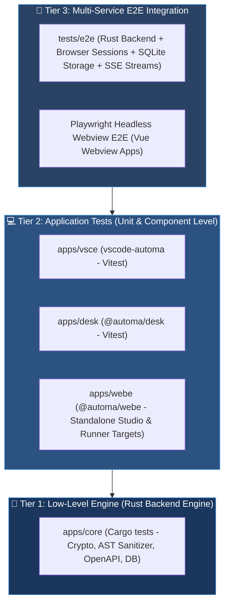

# 🌐 Automa Ecosystem Test Matrix

Welcome to the comprehensive quality assurance and test monitoring hub for the **Automa Ecosystem**. The system follows a multi-tier testing strategy ensuring end-to-end integrity from the low-level Rust Engine to the VS Code Extension, Desktop Application, and Chrome Web Extension.

---

## 🧭 1. Ecosystem Testing Pyramid



---

## 📊 2. Subsystem Test Summary Matrix

| Subsystem (App / Package) | Testing Stack | Tests / Suites | Status | Documentation | Execution Command |
| :--- | :--- | :---: | :---: | :--- | :--- |
| **`apps/vsce`** | Vitest v4 + Biome | **214 tests / 40 suites** | ✅ **Passed** | [📄 apps/vsce Test Matrix](../apps/vsce/docs/TEST_MATRIX.md) | `pnpm -F vscode-automa test` |
| **`apps/core`** | Cargo Test (In-Memory SQLite) | **55 tests** | ✅ **Passed** | [📄 apps/core README](../apps/core/README.md) | `cargo test --manifest-path apps/core/Cargo.toml --lib` |
| **`apps/desk`** | Vitest v4 + Istanbul | **38 tests / 6 suites** | ✅ **Passed** | [📄 apps/desk README](../apps/desk/README.md) | `pnpm -F @automa/desk test:unit` |
| **`apps/webe`** | Webpack 5 + ESLint | **Studio & Silent Runner** | ✅ **Passed** | [📄 apps/webe README](../apps/webe/README.md) | `pnpm -F @automa/webe build:studio` |
| **`@automa/types`** | TypeScript Compiler (`tsc`) | **OpenAPI Typed SDK** | ✅ **Passed** | [📄 types README](../packages/types/README.md) | `pnpm -F @automa/types build` |
| **Root E2E Suite** | Vitest E2E + Typed SDK (Port 8766) | **Integration Suites** | ✅ **Passed** | [📄 tests/e2e Directory](../tests/e2e) | `pnpm test` / `node scripts/test-all.mjs` |

---

## 🛠️ 3. Comprehensive Testing SOP (Run All)

### 1. Test the Entire Ecosystem (All Packages)
```bash
# Run 4-tier testing orchestration across monorepo
pnpm test
# or
node scripts/test-all.mjs
```

### 2. Individual Subsystem Execution
- **VS Code Extension**:
  ```bash
  pnpm -F vscode-automa test
  ```
- **Desktop Application**:
  ```bash
  pnpm -F @automa/desk test:unit
  ```
- **Rust Daemon Core**:
  ```bash
  cargo test --manifest-path apps/core/Cargo.toml --lib
  ```
- **OpenAPI SDK Synchronization Verification**:
  ```bash
  pnpm run sync:api
  ```
- **Full Monorepo Build**:
  ```bash
  pnpm run build
  ```

---

## 🔗 4. Navigation Links

- [🏠 Documentation Hub](Home.md)
- [💻 Detailed apps/vsce Test Matrix](../apps/vsce/docs/TEST_MATRIX.md)
- [📚 Technical Directory: apps/vsce](../apps/vsce/docs/README.md)
