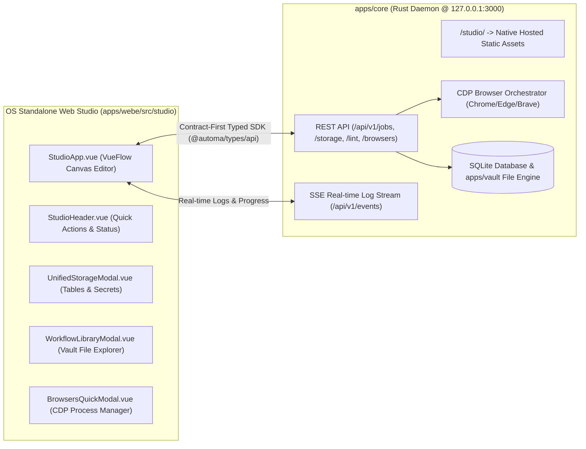

# 📖 User Guide: Automa Web Studio Standalone (`apps/webe/src/studio`)

Comprehensive user manual detailing the architecture, modal interfaces, block tool groups, and step-by-step workflow authoring within the Desktop OS Standalone Studio.

---

## 🔌 1. Core Daemon Integration (`apps/core`) & OS Web Studio (`apps/webe/src/studio`)

Automa Web Studio Standalone executes directly on the desktop operating system (Native OS Mode), served natively by the Rust Daemon (`apps/core`) at:

$$\text{URL}: \mathtt{http://127.0.0.1:3000/studio/}$$

* **Contract-First Type Safety**: All communication between Studio UI and Rust Core is 100% type-safe via the client SDK `@automa/types/api`.
* **Zero Extension Dependency**: Executes standalone in any modern browser without requiring a browser extension.

---

## 🖥️ 2. UI Layout & Component Modals (`apps/webe/src/studio/`)

All interface components belong to the **OS Standalone Web Studio (`apps/webe/src/studio`)**:

### 2.1 Main Studio Workspace Canvas (`apps/webe/src/studio/StudioApp.vue`)
* **Purpose**: Primary visual programming canvas for designing automation workflows (VueFlow DAG Editor).
* **Workspace Panels**:
  * **Top Header Bar ([`StudioHeader.vue`](components/StudioHeader.vue))**:
    * Displays active workflow filename and vault path (`.workflow.json`).
    * Real-time Rust Daemon connectivity indicator ([`StudioCoreStatus.vue`](../components/newtab/workflow/StudioCoreStatus.vue)).
    * Action triggers: **Run** (`Ctrl+Enter`), **Save** (`Ctrl+S`), **Pause/Resume/Stop Job**, **New Workflow**, **Export JSON**.
    * Real-time AST Linter diagnostics count.
  * **Resizable Left Sidebar**:
    * **Block Palette**: Catalog of 50+ automation block primitives.
    * **Block Form Editor**: Contextual inspector configuring properties of the currently selected block.
  * **VueFlow Canvas Area (Center)**:
    * Interactive drag-and-drop node graph canvas.
    * Canvas controls: **Undo** (`Ctrl+Z`), **Redo** (`Ctrl+Y`), **Auto-Align** (automatic node hierarchy layout).

### 2.2 Workflow Library Modal ([`WorkflowLibraryModal.vue`](components/WorkflowLibraryModal.vue))
* **Purpose**: File explorer managing local disk workflows (`apps/vault/*.workflow.json`).
* **Features**:
  * Full-text search by workflow title, tags, or description.
  * Directly load workflows from disk to canvas.
  * Create, duplicate, and delete scenario files.

### 2.3 Unified Storage & Data Modal ([`UnifiedStorageModal.vue`](components/UnifiedStorageModal.vue))
* **Purpose**: Centralized management for offline/cloud tabular data and credentials.
* **Tabs**:
  * **Storage Tables Tab ([`StorageTablesTab.vue`](components/StorageTablesTab.vue))**: Create custom schemas, inspect scraped rows, and export data.
  * **Storage Secrets Tab ([`StorageSecretsTab.vue`](components/StorageSecretsTab.vue))**: Manage global variables and AES-256 encrypted credentials / API keys.

### 2.4 CDP Browser Process Modal ([`BrowsersQuickModal.vue`](components/BrowsersQuickModal.vue))
* **Purpose**: Inspect and supervise active Chromium browser instances controlled via CDP.
* **Features**:
  * List all running Chrome, Edge, and Brave browser windows.
  * Emergency **Kill All Browsers** button: Instantly terminates orphaned browser processes on the host.

### 2.5 Run Workflow Configuration Modal ([`RunWorkflowModal.vue`](components/RunWorkflowModal.vue))
* **Purpose**: Configure execution parameters before launching an automation job.
* **Options**:
  * Display Mode: **Headed** (visible browser) or **Headless** (background execution).
  * Target Browser: Chrome, Edge, Brave.
  * Input Parameters (dynamic variables injected at runtime).

### 2.6 Workflow Quick Settings Modal ([`WorkflowQuickSettings.vue`](components/WorkflowQuickSettings.vue))
* **Purpose**: Configure metadata for the open scenario.
* **Options**: Icon, Title, Description, and error fallback handlers (OnError fallback, retry counts, notifications).

---

## 🧩 3. Block Palette Tool Groups

Inside the canvas editor (`StudioApp.vue`), tool blocks are organized into **6 Core Categories**:

| Category | Category Name | Representative Blocks | Purpose & Capabilities |
| :--- | :--- | :--- | :--- |
| **1. Execution & Control** | `General` | `Trigger`, `Execute Workflow`, `Delay`, `Repeat Task`, `Note` | Flow entry points, timeouts, sub-workflow delegation, and iteration loops. |
| **2. Browser Management** | `Browser` | `Active Tab`, `New Tab`, `Close Tab`, `Switch Tab`, `Take Screenshot`, `Save Assets`, `Set Cookies` | Tab lifecycle, page captures, download handling, cookies, and proxy routing. |
| **3. DOM Interactions** | `Interaction` | `Click Element`, `Type Text`, `Select Dropdown`, `Get Text`, `Scroll Page`, `Hover Element`, `Upload File` | Button clicks, text inputs, dropdown selection, scrolling, file uploads, and attribute scraping. |
| **4. Conditions & Logic** | `Conditions` | `Conditions (If/Else)`, `Element Exists`, `Loop Data`, `Loop Elements`, `Switch Case` | Boolean branching, element assertions, data row loops, and switch routing. |
| **5. Data & Storage** | `Data & Storage` | `Insert Data`, `Get Variable`, `Set Variable`, `Export Data (CSV/JSON)`, `Crypto/Hash` | Read/write state variables, append table rows, data formatting, and cryptographic hashes. |
| **6. Online Integrations** | `Online Services` | `Google Sheets`, `HTTP Request (API)`, `Webhook` | Outbound HTTP requests, external REST integrations, and real-time Google Sheets sync. |

---

## 🛠️ 4. Step-by-Step Workflow Authoring Walkthrough

1. **Start Daemon & Open Web Studio**:
   * Launch the Core Engine: `automa` (Daemon listens on `http://127.0.0.1:3000`).
   * Navigate to `http://127.0.0.1:3000/studio/`. Connectivity indicator reflects **Core Daemon Connected (Green)**.
2. **Create New Workflow**: Click **New Workflow** on the header bar (`StudioHeader.vue`) and name the scenario file.
3. **Assemble DAG Nodes on Canvas (`StudioApp.vue`)**:
   * Drag a **New Tab** block from the left palette onto the canvas $\rightarrow$ Enter target URL (e.g. `https://example.com`).
   * Drag a **Click Element** block $\rightarrow$ Enter CSS selector for the action element.
   * Drag a **Get Text** block $\rightarrow$ Enter selector for target content $\rightarrow$ Map column to Storage Table.
   * Connect node handles sequentially from output to input.
4. **Execute & Export Results**:
   * Click **Run** (`Ctrl+Enter`) $\rightarrow$ Browser launches and executes the sequence.
   * Open **Storage Explorer** (`UnifiedStorageModal.vue`) $\rightarrow$ Inspect extracted records and export to CSV.
