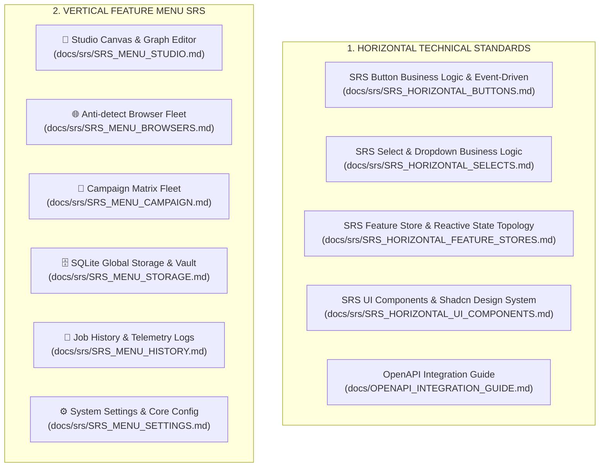

# 📚 Automa Ecosystem: 2D Matrix Specification Hub

> 🔙 Return to Documentation Hub: [**`docs/README.md`**](../README.md) | [**`docs/Home.md`**](../Home.md)

---

## 🏛️ 1. 2D Matrix Architecture Overview

The specification system of the Automa Ecosystem is structured around a **2D Matrix Specification Hub** combining **Horizontal Technical Standards** with **Vertical Feature Menu Specifications**:

---

## 🧠 Architectural Philosophy (The 2D Matrix Mindset)

Why structure specifications across a **2D Matrix** instead of traditional per-folder documentation?

Code evolves continuously: functions get refactored, UI shifts between Desktop and Extension targets. The **2D Matrix establishes an invariant architectural contract** guaranteeing cohesion across the monorepo:

### 1. Two Orthogonal Dimensions:
- **Horizontal Axis (Horizontal Standards - Shared Infrastructure)**:
  - Solves cross-cutting infrastructure independent of visual screens: Button Finite State Machines (Button FSM), Remote Virtualized Selects, Reactive State Management (Pinia Domain Stores), and Theme-Adaptive Design Systems (Shadcn-Vue Tokens).
  - Goal: **100% Consistency & Zero Code Duplication** across all 3 host platforms: Desktop Tauri, VS Code Extension, and Web Extension.
- **Vertical Axis (Vertical Menu Specs - Dedicated Domain Logic)**:
  - Solves domain-specific requirements for each operational screen: Studio Canvas, Anti-detect Browsers, Campaign Matrix, Storage Vault, History Telemetry, and System Settings.
  - Goal: **Centralized Domain-Driven Design (DDD)**.

### 2. The 3 Matrix Invariants:
1. **Zero Ad-Hoc Components**: Vertical screens **must never create bespoke buttons or arbitrary dropdowns**. Every interactive element must inherit a canonical ID (`btn.*`) and adhere to the 7-step FSM defined in the Horizontal Axis.
2. **Zero Polling & Passive Reactivity**: Vertical views must never run raw `setInterval` loops or polling timers. State changes are driven exclusively by SSE `/api/v1/events` or WebSocket `/api/v1/ws` events via Pinia Stores.
3. **Zero Frontend Contract Invention**: Screens must never invent synthetic payload types (`Record<string, unknown>` or `as any`). All network interactions must import directly from the `@automa/types/api` typed SDK.

---

## 📑 2. Specification Directory

### 🌐 A. Horizontal Technical Standards
1. [**SRS Button Business Logic & Event-Driven Schema (`SRS_HORIZONTAL_BUTTONS.md`)**](./SRS_HORIZONTAL_BUTTONS.md): Master catalog of 37 Button actions (`btn.*`), 7-step FSM state machine, and reactive inter-component triggers.
2. [**SRS Select & Dropdown Business Logic Schema (`SRS_HORIZONTAL_SELECTS.md`)**](./SRS_HORIZONTAL_SELECTS.md): Master catalog of 11 Remote Virtualized Selects (`select.*`), virtualization slice algorithms, and search debounce.
3. [**SRS Feature Store & Reactive State Topology (`SRS_HORIZONTAL_FEATURE_STORES.md`)**](./SRS_HORIZONTAL_FEATURE_STORES.md): Master architecture of 6 Pinia Domain Stores and the SSE Event Dispatch Hub.
4. [**SRS UI Components & Shadcn Design System (`SRS_HORIZONTAL_UI_COMPONENTS.md`)**](./SRS_HORIZONTAL_UI_COMPONENTS.md): Master architecture of 19 Shadcn-Vue atomic primitives, theme variable inversion, and synchronization CLI tools (`sync:ui`, `add:ui`, `audit:ui`).
5. [**OpenAPI Integration Guide (`OPENAPI_INTEGRATION_GUIDE.md`)**](../OPENAPI_INTEGRATION_GUIDE.md): Implementation guide for integrating with the Axum daemon using `@automa/types/api`.

---

### 📱 B. Vertical Feature Menu Specifications
1. [**SRS Menu 1: Studio Canvas & Workflow Editor (`SRS_MENU_STUDIO.md`)**](./SRS_MENU_STUDIO.md):
   - VueFlow graph editor, blocks palette drawer, Smart Connect, Action Header, Run Modal, Dynamic Parameters, Lint diagnostics, and Live Debugger Console.
2. [**SRS Menu 2: Browsers Fleet Management (`SRS_MENU_BROWSERS.md`)**](./SRS_MENU_BROWSERS.md):
   - Anti-detect Profile management, 3-tier Cascading Waterfall resolver, auto-detection for Chrome/Brave/Edge, Chromium session lifecycle via `startBrowser()`, and emergency Kill-all.
3. [**SRS Menu 3: Campaign Matrix Scheduler (`SRS_MENU_CAMPAIGN.md`)**](./SRS_MENU_CAMPAIGN.md):
   - Campaign Matrix Grid, parallel multi-profile execution, slot allocation, and real-time telemetry tracking (`campaign_slot_progress`).
4. [**SRS Menu 4: Storage & Vault Cryptography (`SRS_MENU_STORAGE.md`)**](./SRS_MENU_STORAGE.md):
   - Dynamic SQLite tables, public variables `{{variables.*}}`, cryptographic secret vault `HMAC-SHA256 + AES-256-CBC` `{{secrets.*}}`, and Workspace File Explorer.
5. [**SRS Menu 5: History & Telemetry Explorer (`SRS_MENU_HISTORY.md`)**](./SRS_MENU_HISTORY.md):
   - Job execution audit trail, status filters, block-level trace inspection, timing analytics, and performance benchmarks.
6. [**SRS Menu 6: Settings & Core Daemon Configuration (`SRS_MENU_SETTINGS.md`)**](./SRS_MENU_SETTINGS.md):
   - Daemon Host/Port `:8765`, heartbeat health monitoring, Master Passphrase lifecycle, Dark/Light/System theme tokens, and workspace storage paths.
