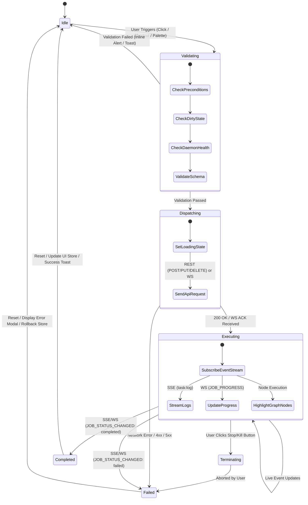
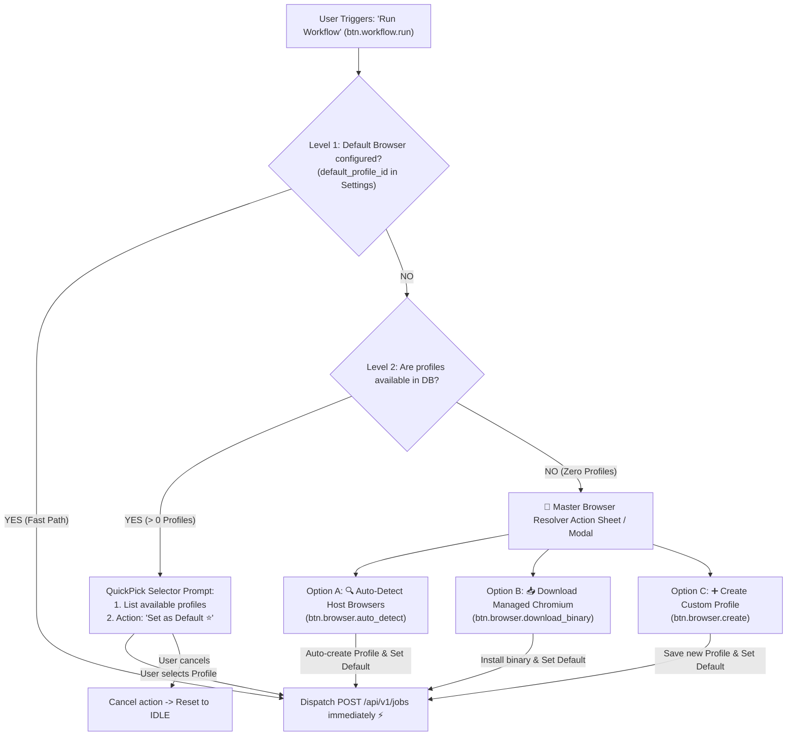
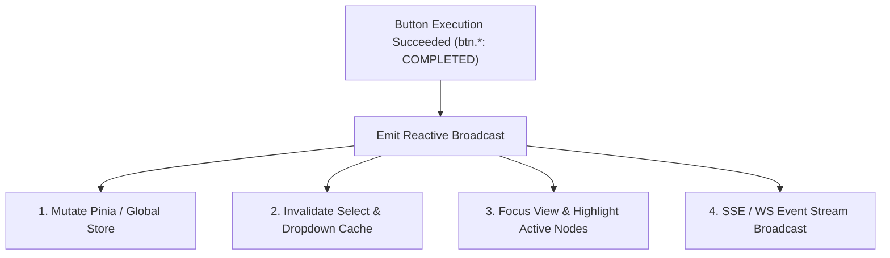

# Software Requirements Specification (SRS)
## Event-Driven Button Business Logic & OpenAPI Prototype Schema

**Document Version:** 1.0.0  
**Target Platforms:** `apps/core`, `apps/desk`, `apps/vsce`, `apps/webe`, `packages/types`  
**Architecture Paradigm:** Contract-First, Zero-Dummy UI, Event-Driven Architecture (EDA) via REST, WebSocket (`/api/v1/ws`), and SSE (`/api/v1/events`).

---

## 1. 🎯 Executive Summary & Purpose

This document specifies the complete **Business Logic Prototype Schema** for action buttons and triggers across the Automa Ecosystem (`apps/desk`, `apps/vsce`, `apps/webe` Studio).

### Standardization Objectives:
1. **Zero-Dummy UI**: 100% of user interface buttons must be backed by a functional execution handler connected directly to the `apps/core` backend via OpenAPI v3 contracts (`@automa/types/api`).
2. **Event-Driven Architecture (EDA)**: Buttons act strictly as **Event Dispatchers**. Execution workflows, state transitions, spinner animations, canvas node highlighting, and log streams react purely to asynchronous real-time event streams (SSE `/api/v1/events` or WebSocket `/api/v1/ws`).
3. **Deterministic State Machine**: Every button conforms to a finite state machine (FSM): `Idle` $\rightarrow$ `Validating` $\rightarrow$ `Dispatching` $\rightarrow$ `Executing/Streaming` $\rightarrow$ `Completed`/`Failed` $\rightarrow$ `Idle`.
4. **Strict Type Safety**: Every request payload and event response maps 1:1 with OpenAPI Operation IDs and WebSocket message schemas.

---

## 2. 🏛️ Event-Driven Button Architecture & State Machine



---

### 2.1. 🌊 Pre-flight Cascading & Browser Resolution Waterfall

When execution is triggered (e.g. `btn.workflow.run`), the state machine enters the `VALIDATING` phase. To guarantee execution environment readiness and prevent runtime failures, the system executes the **Cascading Browser Resolution Waterfall**:



#### 3-Tier Resolution Rules:
1. **Level 1 (Fast Path - Happy Flow)**: If `browser.default_profile_id` is set in Settings and exists in SQLite $\rightarrow$ Immediately transition to `DISPATCHING` sending `POST /api/v1/jobs`.
2. **Level 2 (Selection Prompt - Missing Default)**: If profiles exist in the DB but no default is selected $\rightarrow$ Render QuickPick/Modal listing available profiles, offering an option to save as default (`⭐ Set as Default`).
3. **Level 3 (Master Browser Resolver - Zero Profiles / Missing Binary)**: If the database has zero profiles or no Chromium binary exists $\rightarrow$ Present the Master Browser Resolver Sheet offering 3 self-healing paths.

---

## 3. 📐 Canonical TypeScript Schema Definition

Standardized schema for button configuration across the ecosystem:

```typescript
import type { AutomaWsCommand, AutomaWsEvent } from '@automa/types/ws';
import type { ApiErrorResponse } from '@automa/types/api';

/**
 * UI context scopes for button rendering
 */
export type ButtonContextScope =
  | 'WorkflowCanvas'
  | 'CampaignMatrix'
  | 'BrowserManager'
  | 'StorageExplorer'
  | 'HistoryLogs'
  | 'SystemTitlebar'
  | 'CommandPalette';

/**
 * FSM button execution states
 */
export type ButtonExecutionState =
  | 'IDLE'
  | 'VALIDATING'
  | 'DISPATCHING'
  | 'EXECUTING'
  | 'TERMINATING'
  | 'COMPLETED'
  | 'FAILED';

/**
 * Confirmation modal configuration for critical/destructive actions
 */
export interface ConfirmationModalConfig {
  title: string;
  message: string;
  confirmText: string;
  cancelText?: string;
  variant: 'default' | 'destructive' | 'warning';
}

/**
 * OpenAPI REST dispatch contract
 */
export interface RestDispatchContract {
  type: 'REST';
  operationId: string;
  method: 'GET' | 'POST' | 'PUT' | 'DELETE' | 'PATCH';
  pathTemplate: string;
  buildPayload?: (context: unknown) => Record<string, unknown> | undefined;
}

/**
 * WebSocket dispatch contract
 */
export interface WebSocketDispatchContract {
  type: 'WEBSOCKET';
  commandType: AutomaWsCommand['type'];
  buildCommand: (context: unknown) => AutomaWsCommand;
}

/**
 * IPC dispatch contract (Tauri / VS Code)
 */
export interface IpcDispatchContract {
  type: 'IPC';
  channel: string;
  buildPayload?: (context: unknown) => unknown;
}

export type ButtonDispatchContract =
  | RestDispatchContract
  | WebSocketDispatchContract
  | IpcDispatchContract;

/**
 * Reactive event listeners
 */
export interface EventReactionRule {
  source: 'SSE' | 'WEBSOCKET' | 'IPC';
  eventType: string;
  handler: (eventData: unknown, buttonContext: unknown) => void;
}

/**
 * Complete prototype schema definition for an action button
 */
export interface ButtonBusinessLogicSchema<TContext = unknown, TResponse = unknown> {
  /** Unique canonical identifier: domain.subdomain.action */
  id: string;
  
  /** UI context scope */
  context: ButtonContextScope;

  /** Presentation & Accessibility attributes */
  presentation: {
    label: string;
    icon: string;
    dataTestId: string;
    tooltip?: string;
    keyboardShortcut?: string;
    badgeCountKey?: string;
  };

  /** Preconditions required before dispatch */
  preConditions: {
    requiresDaemonHealthy?: boolean;
    requiresSelection?: boolean;
    requiresDirtyState?: boolean;
    customValidator?: (context: TContext) => boolean | Promise<boolean>;
    confirmationModal?: ConfirmationModalConfig;
  };

  /** Protocol dispatch details */
  dispatch: ButtonDispatchContract;

  /** Event reaction rules during execution */
  eventReactions?: EventReactionRule[];

  /** Post-conditions and mutations upon completion */
  postConditions: {
    onSuccess: (response: TResponse, context: TContext) => void;
    onError: (error: ApiErrorResponse | Error, context: TContext) => void;
    mutateStoreKeys?: string[];
    refreshQueries?: string[];
  };
}
```

---

## 4. 📋 Standardized Button Catalog

### 4.1. Workflow & Canvas Execution Subsystem (`Jobs`, `Lint`)

| Button ID | Label & Icon | `data-testid` | OpenAPI `operation_id` | Protocol & Payload | Event-Driven Reactions |
| :--- | :--- | :--- | :--- | :--- | :--- |
| **`btn.workflow.run`** | **Run Workflow** <br>`▶` Play | `btn-run-workflow` | `submit_job` | `POST /api/v1/jobs`<br>`SubmitJobRequest` | • Precondition: Resolve `defaultBrowser` (or open QuickPick if unset)<br>• SSE `task:log` $\rightarrow$ Live output console<br>• WS `JOB_PROGRESS` $\rightarrow$ Highlight active node<br>• WS `JOB_STATUS_CHANGED` (running $\rightarrow$ completed) |
| **`btn.workflow.pause`** | **Pause Execution** <br>`⏸` Pause | `btn-pause-workflow` | *WebSocket* | WS Command:<br>`{ type: 'PAUSE_JOB', jobId }` | • WS `JOB_STATUS_CHANGED` (`status: 'paused'`) $\rightarrow$ Switch icon to Resume |
| **`btn.workflow.resume`** | **Resume Execution** <br>`▶` Play | `btn-resume-workflow` | *WebSocket* | WS Command:<br>`{ type: 'RESUME_JOB', jobId }` | • WS `JOB_STATUS_CHANGED` (`status: 'running'`) $\rightarrow$ Switch icon to Pause |
| **`btn.workflow.stop`** | **Stop / Kill** <br>`⏹` Square | `btn-stop-workflow` | `kill_job` | `DELETE /api/v1/jobs/{job_id}`<br>or WS `KILL_JOB` | • WS `JOB_STATUS_CHANGED` (`status: 'stopped'`) $\rightarrow$ Reset button state to Idle |
| **`btn.workflow.create`** | **New Workflow** <br>`➕` Plus | `btn-create-workflow` | *Client Action* | IPC `workflow:create` | • Initializes a blank workflow canvas |
| **`btn.workflow.save`** | **Save Workflow** <br>`💾` Save | `btn-save-workflow` | `save_workflow` / `update_storage_workflow` | `PUT /api/v1/storage/workflow`<br>`SaveWorkflowPayload` | • Store: clear `isDirty = false`<br>• VSCE: Remove dirty dot indicator on editor tab |
| **`btn.workflow.import`** | **Import Workflow** <br>`📥` Upload | `btn-import-workflow` | *Client Action* | IPC `workflow:import` | • Reads `.workflow.json` from disk into canvas |
| **`btn.workflow.export`** | **Export JSON** <br>`💾` Download | `btn-export-workflow` | *Client Action* | IPC `workflow:export` | • Serializes active workflow to `.workflow.json` |
| **`btn.workflow.delete`** | **Delete Workflow** <br>`🗑️` Trash2 | `btn-delete-workflow` | `delete_storage_workflow` | `DELETE /api/v1/storage/workflows/{id}` | • Precondition: `isJobRunning == false`<br>• Destructive Confirmation Modal<br>• Invalidate `select.storage.workflow` and reload list<br>• Fallback to remaining workflow or blank canvas<br>• IPC `automa:workflow-deleted` |
| **`btn.workflow.lint`** | **Lint & Check** <br>`🔍` Sparkles | `btn-lint-workflow` | `lint_workflow` | `POST /api/v1/lint`<br>`LintWorkflowRequest` | • Highlights canvas nodes with lint diagnostics<br>• Focus Problems panel |
| **`btn.workflow.open_studio`** | **Open in Studio** <br>`🖥️` ExternalLink | `btn-open-studio` | `open_web_studio` | `POST /api/v1/system/studio/session` | • Spawns/attaches standalone VueFlow canvas view |

---

### 4.2. Campaign & Matrix Fleet Scheduling Subsystem (`Campaigns`)

| Button ID | Label & Icon | `data-testid` | OpenAPI `operation_id` | Protocol & Payload | Event-Driven Reactions |
| :--- | :--- | :--- | :--- | :--- | :--- |
| **`btn.campaign.run_matrix`** | **Execute Matrix** <br>`🚀` Rocket | `btn-run-campaign` | `execute_campaign` | `POST /api/v1/campaigns/execute`<br>`ExecuteCampaignRequest` | • SSE `/api/v1/events` (`CAMPAIGN_PROGRESS`)<br>• Live matrix slots progress updates |
| **`btn.campaign.abort`** | **Abort Matrix** <br>`🛑` OctagonAlert | `btn-abort-campaign` | `abort_campaign` | `DELETE /api/v1/campaigns/{id}` | • Terminates active parallel jobs in matrix<br>• Renders matrix cancellation summary |
| **`btn.campaign.refresh`** | **Refresh Matrix** <br>`🔄` RefreshCw | `btn-refresh-matrix` | `get_campaign_matrix_status` | `GET /api/v1/campaigns/{id}/matrix-status` | • Re-renders matrix slot cards & metrics |
| **`btn.campaign.create`** | **New Campaign** <br>`➕` Plus | `btn-create-campaign` | `create_storage_campaign` | `POST /api/v1/storage/campaigns`<br>`CreateCampaignStorageRequest` | • Persists into SQLite store<br>• Opens campaign designer view |
| **`btn.campaign.delete`** | **Delete Campaign** <br>`🗑️` Trash2 | `btn-delete-campaign` | `delete_storage_campaign` | `DELETE /api/v1/storage/campaigns/{id}` | • Modal confirm $\rightarrow$ Removes campaign $\rightarrow$ Toast success |

---

### 4.3. Anti-Detect Browser Profiles Subsystem (`Browsers`)

| Button ID | Label & Icon | `data-testid` | OpenAPI `operation_id` | Protocol & Payload | Event-Driven Reactions |
| :--- | :--- | :--- | :--- | :--- | :--- |
| **`btn.browser.launch`** | **Launch Browser** <br>`🌐` Chrome/Globe | `btn-launch-browser` | `start_browser_session` | `POST /api/v1/browsers/{id}/session` | • Updates status badge: `Offline` $\rightarrow$ `Online`<br>• Displays active debug CDP port |
| **`btn.browser.stop`** | **Stop Session** <br>`⏻` Power | `btn-stop-browser` | `stop_browser_session` | `DELETE /api/v1/browsers/{id}/session` | • Closes Chromium instance $\rightarrow$ Badge `Offline` |
| **`btn.browser.kill_all`** | **Kill All Sessions** <br>`⚡` ZapOff | `btn-kill-all-browsers` | `kill_all_browsers` | `DELETE /api/v1/browsers/sessions` | • Emergency process termination across all instances |
| **`btn.browser.create`** | **Create Profile** <br>`➕` Plus | `btn-create-browser` | `create_browser` | `POST /api/v1/browsers`<br>`CreateBrowserRequest` | • Saves to SQLite $\rightarrow$ Appends to Browsers list |
| **`btn.browser.import_csv`** | **Import CSV** <br>`📥` Upload | `btn-import-browsers-csv` | `import_browsers_csv` | `POST /api/v1/browsers/import-csv`<br>`ImportCsvPayload` | • Batch insertion $\rightarrow$ Refreshes list $\rightarrow$ Toast count |
| **`btn.browser.import_cookies`** | **Import Cookies** <br>`🍪` Cookie | `btn-import-cookies` | `import_browser_cookies` | `POST /api/v1/browsers/{id}/cookies`<br>`ImportCookiesPayload` | • Injects Netscape JSON cookies into profile |
| **`btn.browser.sideload_ext`** | **Add Extension** <br>`🧩` Puzzle | `btn-sideload-ext` | `sideload_browser_extension` | `POST /api/v1/browsers/{id}/extensions`<br>`SideloadExtensionPayload` | • Attaches unpacked extension directory to profile |
| **`btn.browser.set_default`** | **Set as Default** <br>`⭐` Star | `btn-set-default-browser` | `patch_app_settings` | `PATCH /api/v1/system/settings`<br>`{ "browser": { "default_profile_id": "{id}" } }` | • Persists default browser profile into SQLite<br>• Adds `⭐ [Default]` badge and strips old star<br>• Subsequent `Run Workflow` calls use this profile directly |
| **`btn.browser.auto_detect`** | **Auto-Detect Host Browsers** <br>`🔍` Scan | `btn-autodetect-browsers` | `auto_detect_browsers` | `POST /api/v1/browsers/auto-detect` | • Scans Chrome/Edge/Brave/Chromium executables on host<br>• Automatically provisions profiles and defaults first match |
| **`btn.browser.download_binary`** | **Download Managed Chromium** <br>`📥` DownloadCloud | `btn-download-chromium` | `install_browser_binary` | `POST /api/v1/system/browser-binaries`<br>`{ "browser": "chromium" }` | • Downloads portable Chromium from Google Storage<br>• Emits download progress via SSE $\rightarrow$ Sets default profile |

---

### 4.4. Global Storage Subsystem (`Storage`, `Secrets`)

| Button ID | Label & Icon | `data-testid` | OpenAPI `operation_id` | Protocol & Payload | Event-Driven Reactions |
| :--- | :--- | :--- | :--- | :--- | :--- |
| **`btn.storage.table.add`** | **Create Table** <br>`➕` Plus | `btn-add-table` | `add_storage_table` | `POST /api/v1/storage/tables`<br>`AddTableRequest` | • Column schema editor $\rightarrow$ Persist SQLite $\rightarrow$ Refresh |
| **`btn.storage.table.add_row`** | **Add Row** <br>`➕` PlusCircle | `btn-add-table-row` | `add_storage_table_row` | `POST /api/v1/storage/tables/{id}/rows`<br>`AddTableRowRequest` | • In-place grid edit $\rightarrow$ Sync SQLite |
| **`btn.storage.table.delete`** | **Delete Table** <br>`🗑️` Trash | `btn-delete-table` | `delete_storage_table` | `DELETE /api/v1/storage/tables/{id}` | • Modal confirmation $\rightarrow$ Removes table |
| **`btn.storage.var.add`** | **New Variable** <br>`➕` Plus | `btn-add-variable` | `add_storage_variable` | `POST /api/v1/storage/variables`<br>`StorageVariablePayload` | • Plaintext public variable persisted |
| **`btn.storage.var.delete`** | **Delete Variable** <br>`🗑️` Trash | `btn-delete-variable` | `delete_storage_variable` | `DELETE /api/v1/storage/variables/{id}` | • Removes key from global variables store |
| **`btn.storage.cred.add`** | **New Credential** <br>`🔒` Lock | `btn-add-credential` | `add_storage_credential` | `POST /api/v1/storage/credentials`<br>`AddCredentialRequest` | • AES-256 encrypted in RAM with master passphrase |
| **`btn.storage.cred.delete`** | **Delete Credential** <br>`🗑️` Trash | `btn-delete-credential` | `delete_storage_credential` | `DELETE /api/v1/storage/credentials/{id}` | • Removes encrypted secret from SQLite |

---

### 4.5. Telemetry & Execution History Subsystem (`History`, `Events`)

| Button ID | Label & Icon | `data-testid` | OpenAPI `operation_id` | Protocol & Payload | Event-Driven Reactions |
| :--- | :--- | :--- | :--- | :--- | :--- |
| **`btn.history.clear_all`** | **Clear History** <br>`🧹` Trash2 | `btn-clear-history` | `clear_all_job_history` | `DELETE /api/v1/history` | • Modal confirmation $\rightarrow$ Purges all execution records |
| **`btn.history.delete_item`** | **Delete Log Item** <br>`✕` X | `btn-delete-history-item` | `delete_job_history_item` | `DELETE /api/v1/history/{job_id}` | • Removes specific job trace and logs |
| **`btn.history.view_logs`** | **Inspect Logs** <br>`📋` FileText | `btn-view-job-logs` | `get_job_execution_logs` | `GET /api/v1/history/{job_id}/logs` | • Fetches log records $\rightarrow$ Renders in virtualized list |
| **`btn.history.export_logs`** | **Export JSON/Text** <br>`💾` Download | `btn-export-logs` | *Client Action* | Local serialization | • Triggers OS save dialog for log dump |

---

### 4.6. System, Window Ergonomics & Command Palette Subsystem (`System`, `Settings`)

| Button ID | Label & Icon | `data-testid` | OpenAPI `operation_id` / IPC | Protocol & Payload | Event-Driven Reactions |
| :--- | :--- | :--- | :--- | :--- | :--- |
| **`btn.system.health_check`** | **Daemon Status** <br>`🟢` Activity | `btn-health-check` | `get_health` | `GET /api/v1/health` | • Heartbeat ping status badge (Online/Offline) |
| **`btn.system.command_palette`** | **Command Palette** <br>`⌨️` `Ctrl+K` | `btn-command-palette` | *Client Action* | Shortcut / Click event | • Opens fuzzy command modal for quick actions |
| **`btn.system.toggle_theme`** | **Theme Mode** <br>`🌓` Sun/Moon | `btn-toggle-theme` | `patch_app_settings` | `PATCH /api/v1/system/settings`<br>`UpdateAppSettingsRequest` | • Toggles Dark / Light mode across Webview and Titlebar |
| **`btn.window.minimize`** | **Minimize** <br>`🗕` Minus | `btn-window-minimize` | Tauri IPC / Window | `appWindow.minimize()` | • Minimizes window to Taskbar or Tray |
| **`btn.window.maximize`** | **Maximize/Restore** <br>`🗖` Square | `btn-window-maximize` | Tauri IPC / Window | `appWindow.toggleMaximize()` | • Toggles full-screen maximize/restore state |
| **`btn.window.close`** | **Close Window** <br>`✕` Close | `btn-window-close` | Tauri IPC / Window | `appWindow.close()` | • Checks minimize-to-tray setting or terminates app |

---

## 5. ⚡ Event-Driven Reaction Pipeline (SSE & WebSocket)

When any button dispatches an asynchronous job or session, the system updates through event streams:

```text
[Button Click Trigger] 
       │
       ▼
[OpenAPI REST / WS Command] ──(200 OK + JobId)──► [Button FSM State: EXECUTING]
                                                              │
      ┌──────────────────────────────────────────────────────┴──────────────────────────────────────────────────────┐
      │                                                                                                             │
      ▼                                                                                                             ▼
[SSE: /api/v1/events]                                                                                   [WebSocket: /api/v1/ws]
  • event: "task:started"   ──► Update button spinner                                                     • type: "JOB_PROGRESS" ──► Step increment
  • event: "task:log"       ──► Stream log text to Output Console                                         • type: "SYSTEM_METRICS" ──► CPU/Memory meter
  • event: "task:completed" ──► Button FSM: COMPLETED -> IDLE (Green Toast)                               • type: "JOB_STATUS_CHANGED" (stopped) ──► Reset to IDLE
  • event: "task:error"     ──► Button FSM: FAILED -> IDLE (Error Modal)
```

---

## 6. 🛡️ Guardrails, Linter & Zero-Dummy Compliance

To ensure compliance with engineering standards:
1. **Mandatory `data-testid`**:
   - Format: `btn-<kebab-case-action>` (e.g. `btn-run-workflow`, `btn-launch-browser`).
2. **No Silent Execution**:
   - Dispatching actions (`Run Workflow`, `Execute Matrix`) must focus the console log window and display status feedback.
3. **Double Click Prevention (Debounce & State Guard)**:
   - In `VALIDATING` or `DISPATCHING` states, buttons must set `disabled` or `aria-busy="true"` to block duplicate submissions.
4. **Destructive Operation Confirmation**:
   - Destructive actions (`delete_browser`, `clear_all_job_history`, `delete_storage_table`) require a `ConfirmationModal` before calling the backend.

---

## 7. 💻 Production Implementation Example (Vue 3 Composable)

```typescript
import { ref, computed } from 'vue';
import { submitJob, killJob } from '@automa/types/api';
import type { ButtonBusinessLogicSchema, ButtonExecutionState } from './button-schema';

export function useWorkflowRunButton(workflowId: string, workflowPath: string) {
  const state = ref<ButtonExecutionState>('IDLE');
  const activeJobId = ref<string | null>(null);
  const errorMessage = ref<string | null>(null);

  const isLoading = computed(() => state.value === 'VALIDATING' || state.value === 'DISPATCHING');
  const isRunning = computed(() => state.value === 'EXECUTING');

  async function handleButtonClick() {
    if (isRunning.value && activeJobId.value) {
      // If running, button click triggers STOP
      state.value = 'TERMINATING';
      try {
        await killJob({ path: { job_id: activeJobId.value } });
      } catch (err) {
        console.error('Failed to stop job:', err);
      }
      return;
    }

    if (state.value !== 'IDLE') return;

    // Phase 1: Validation
    state.value = 'VALIDATING';
    if (!workflowPath) {
      errorMessage.value = 'Workflow path is required';
      state.value = 'IDLE';
      return;
    }

    // Phase 2: Dispatching API
    state.value = 'DISPATCHING';
    try {
      const response = await submitJob({
        body: {
          workflow_path: workflowPath,
          options: { headless: true },
        },
      });

      if (response.data && response.data.job_id) {
        activeJobId.value = response.data.job_id;
        state.value = 'EXECUTING';
      }
    } catch (err: any) {
      state.value = 'FAILED';
      errorMessage.value = err?.message || 'Failed to submit workflow execution job';
      setTimeout(() => { state.value = 'IDLE'; }, 3000);
    }
  }

  // Phase 3: Event-Driven Reaction (called by SSE or WS listener)
  function handleJobStatusEvent(event: { jobId: string; status: string; error?: string }) {
    if (event.jobId !== activeJobId.value) return;

    if (event.status === 'completed') {
      state.value = 'COMPLETED';
      setTimeout(() => { state.value = 'IDLE'; activeJobId.value = null; }, 1500);
    } else if (event.status === 'failed' || event.status === 'stopped') {
      state.value = 'FAILED';
      errorMessage.value = event.error || 'Execution failed';
      setTimeout(() => { state.value = 'IDLE'; activeJobId.value = null; }, 2000);
    }
  }

  return {
    state,
    isLoading,
    isRunning,
    errorMessage,
    handleButtonClick,
    handleJobStatusEvent,
  };
}
```

---

## 8. 📌 Monorepo Integration & Development Workflow

1. **Document Location**: `docs/srs/SRS_HORIZONTAL_BUTTONS.md`.
2. **Types Export**: `packages/types/src/button.ts` inherits all types defined in this document.
3. **Automated Testing**: Vitest test suites (`apps/vsce`, `apps/desk`) verify that 100% of button `data-testid` elements exist and respond per the FSM contract.

---

## ⚡ 9. Cross-Component Reactive Matrix

When an action button (`btn.*`) succeeds, it **MUST emit reactive side-effects** propagating state to dependent UI components, Pinia Stores, and Select Dropdowns:



### 📋 Cross-Component Reactive Matrix

| Button (`btn.*`) | Broadcast Event (SSE / WS / IPC) | Dependent Components & Selects | Required Reactive Side-Effect |
|---|---|---|---|
| `btn.workflow.run` | SSE: `job_status: running` | `ExecutionConsole.vue`, Canvas Nodes, `btn.workflow.pause`, `btn.workflow.stop` | Focuses console drawer, pulses glow border on active Node, enables Pause/Stop buttons. |
| `btn.workflow.pause` | WS: `PAUSE_JOB` | `btn.workflow.resume`, Canvas debugger bar | Switches button state to Resume, halts execution at active breakpoint. |
| `btn.workflow.resume` | WS: `RESUME_JOB` | `btn.workflow.pause`, Canvas execution highlighter | Switches button state to Pause, resumes execution flow. |
| `btn.workflow.stop` | REST: `kill_job` $\rightarrow$ SSE: `job_status: stopped` | `btn.workflow.run`, `ExecutionConsole.vue`, Matrix grid slots | Re-enables Run button, logs termination warning, frees matrix grid slot. |
| `btn.workflow.save` | REST / IPC: `workflow_saved` | `select.storage.workflow`, `AutomaFilesProvider`, Store `isDirty` | Resets `isDirty = false`, reloads `select.storage.workflow` in background, updates tree view. |
| `btn.browser.create` | REST: `create_browser` $\rightarrow$ SSE: `browser_created` | `select.browser.profile`, `BrowsersPanel`, Badge `browsers` | Refreshes `select.browser.profile`, increments profile count badge, renders new card. |
| `btn.browser.delete` | REST: `delete_browser` $\rightarrow$ SSE: `browser_deleted` | `select.browser.profile`, `BrowsersPanel`, `useBrowserWaterfall` | Removes option from `select.browser.profile`, removes card from UI, decrements badge count. |
| `btn.browser.launch` | REST: `launch_browser` $\rightarrow$ SSE: `browser_online` | `select.browser.profile`, Browser Card Status Badge | Updates profile status badge to `Online / Green`, activates CDP Inspect action. |
| `btn.browser.kill` | REST: `kill_browser` $\rightarrow$ SSE: `browser_offline` | `select.browser.profile`, Browser Card Status Badge | Reverts status badge to `Offline / Gray`, disables CDP Inspect action. |
| `btn.campaign.matrix.run` | REST: `execute_campaign` $\rightarrow$ SSE: `campaign_started` | `MatrixGrid.vue`, `select.history.job_filter`, `HistoryView.vue` | Launches matrix grid layout, filters history to `running`, streams slot logs. |
| `btn.campaign.abort` | REST: `abort_campaign` $\rightarrow$ SSE: `campaign_aborted` | `MatrixGrid.vue`, Slot badges | Marks active slots as aborted/red, releases worker resources. |
| `btn.storage.table.create` | REST: `create_storage_table` $\rightarrow$ SSE: `storage_table_changed` | `select.storage.table`, `StorageTreeDataProvider`, `TableView.vue` | Invalidates `select.storage.table` cache, adds table to storage sidebar tree. |
| `btn.storage.variable.create` | REST: `add_storage_variable` $\rightarrow$ SSE: `storage_variable_changed` | `select.storage.variable`, Variable Autocomplete Helper | Invalidates `select.storage.variable`, updates autocomplete hints for `{{variables.KEY}}`. |
| `btn.storage.credential.create` | REST: `add_storage_credential` $\rightarrow$ SSE: `storage_credential_changed` | `select.storage.credential`, Secret Autocomplete Helper | Invalidates `select.storage.credential`, updates autocomplete hints for `{{secrets.KEY}}`. |
| `btn.storage.database.sync` | REST: `sync_database` $\rightarrow$ SSE: `storage_database_synced` | All 4 Storage Selects (`workflow`, `table`, `variable`, `credential`) | Concurrently re-fetches all storage datasets without reloading the page. |

---

## 🔍 10. Agent Cross-Checking Protocol

When developing or modifying any UI button, agents **MUST** execute a 3-step verification:
1. **Source Inspection**: Identify the exact event emitted upon success (`onSuccess`).
2. **Reactive Cascade Check**: Consult the **Cross-Component Reactive Matrix (Section 9)** to identify all dependent dropdowns, Pinia stores, and views.
3. **Refetch / Invalidation Verification**: Ensure dependent components attach SSE/WS listeners for background updates without requiring manual browser/webview reload.
