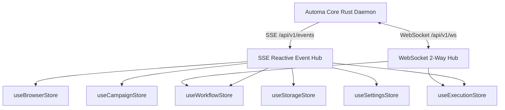
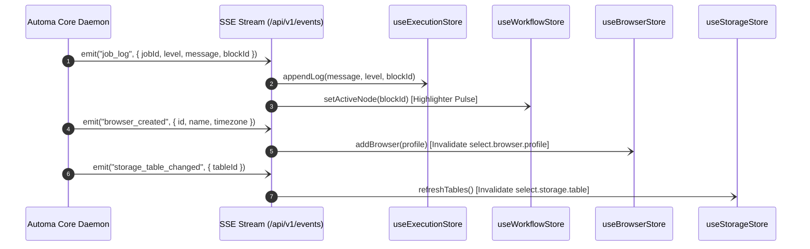

# 🏛️ SRS Horizontal Feature Store & Reactive State Topology Specification

---

## 🎯 1. Overview & Store Architecture Principles

This document serves as the **Master Technical Specification (SRS)** standardizing the state management architecture through **Feature-Scoped Stores** across the Automa Ecosystem (**`apps/desk`**, **`apps/vsce`**, **`apps/webe`**).

The objective is to establish a **Single Source of Truth** for each domain subsystem, enabling action buttons (`btn.*`), dropdowns (`select.*`), and views to react instantaneously to real-time event streams emitted by the Rust Core Daemon (`/api/v1/events` & `/api/v1/ws`).



---

### 🛡️ Standard 4-Tier Structure of Each Feature Store

Every Feature Store in the ecosystem **MUST** adhere to a uniform 4-tier structure:

```
┌─────────────────────────────────────────────────────────────┐
│ 1. State Slice (Strictly typed from @automa/types)          │
├─────────────────────────────────────────────────────────────┤
│ 2. Computed / Getters (Reactive Derived Data)               │
├─────────────────────────────────────────────────────────────┤
│ 3. Actions & FSM Mutators (Button execution & mutations)    │
├─────────────────────────────────────────────────────────────┤
│ 4. SSE / WS Event Listeners (Auto-refetch & Invalidation)   │
└─────────────────────────────────────────────────────────────┘
```

---

## 📊 2. Detailed Breakdown of 6 Domain Feature Stores

---

### 1. `useWorkflowStore` — Canvas & Workflow AST Graph Management
* **Scope**: Manages nodes/edges on the VueFlow Canvas, dirty tracking state (`isDirty`), breakpoints, and linter issues.
* **State Slice**:
  ```typescript
  interface WorkflowStoreState {
    workflow: Partial<Workflow>;
    workflowId: string;
    isDirty: boolean;
    activeNodeId: string | null;
    breakpoints: string[];
    fsmState: ButtonExecutionState;
    lintIssues: Array<{ id: string; nodeId?: string; message: string; severity: 'error' | 'warning' | 'info' }>;
  }
  ```
* **Derived Getters**:
  - `validNodesCount`: Counts valid nodes on canvas.
  - `hasUnsavedChanges`: Checks if canvas has unsaved edits.
  - `isExecuting`: Returns `true` when `fsmState === 'EXECUTING'`.
* **Reactive Side-Effects**:
  - On `setWorkflow()`: Automatically triggers `lint_workflow` for AST analysis.
  - On `btn.workflow.save` completion: Sets `isDirty = false`, emits `workflow_saved` event to `select.storage.workflow`.

---

### 2. `useBrowserStore` — Browser Fleet & Anti-Detect Profile Management
* **Scope**: Manages browser profiles from SQLite DB, online/offline status, and launch priority (Waterfall Resolution).
* **State Slice**:
  ```typescript
  interface BrowserStoreState {
    browsers: BrowserResponse[];
    selectedBrowserId: string;
    onlineBrowserIds: string[];
    waterfallResolution: { activeType: string; executablePath: string | null; isDetected: boolean };
    isLoading: boolean;
    searchQuery: string;
  }
  ```
* **SSE Event Invalidation Bindings**:
  - `browser_created`: Appends new profile to `browsers` array, updates `select.browser.profile`.
  - `browser_deleted`: Removes profile from `browsers`, falls back `selectedBrowserId` to `default`.
  - `browser_online` / `browser_offline`: Updates `onlineBrowserIds` to alter status badge color.

---

### 3. `useCampaignStore` — Campaign Matrix Fleet Management
* **Scope**: Manages campaign matrix configurations, grid slot allocations, and concurrent execution progress.
* **State Slice**:
  ```typescript
  interface CampaignStoreState {
    campaignId: string | null;
    campaignName: string;
    activeSlots: Array<{
      slotIndex: number;
      browserId: string;
      workflowId: string;
      status: 'idle' | 'running' | 'completed' | 'failed';
      progressPercent: number;
    }>;
    status: 'idle' | 'running' | 'aborted' | 'completed';
    totalSlots: number;
  }
  ```
* **SSE Event Bindings**:
  - `campaign_slot_progress`: Updates `progressPercent` of the corresponding slot in the CSS Grid.
  - `campaign_aborted`: Resets all active slots to `aborted` and releases resources.

---

### 4. `useStorageStore` — Business Database Management (Tables, Variables, Credentials)
* **Scope**: Manages data tables, global variables, encrypted secret keys, and workspace file trees.
* **State Slice**:
  ```typescript
  interface StorageStoreState {
    tables: Array<{ id: string; name: string; rowCount?: number }>;
    activeTableId: string | null;
    activeTableRows: Array<{ id: string; [key: string]: unknown }>;
    variables: Array<{ id: string; key: string; name: string; value: unknown }>;
    credentials: Array<{ id: string; key: string; name: string }>;
    isLoading: boolean;
  }
  ```
* **Reactive Side-Effects**:
  - On `storage_table_changed`: Re-fetches `get_storage_tables` and refreshes `select.storage.table`.
  - On `storage_variable_changed`: Updates autocomplete registry for `{{variables.KEY}}` across input fields.

---

### 5. `useExecutionStore` — Real-Time Execution Monitoring & Telemetry Logs
* **Scope**: Manages telemetry buffer, step-level execution logs, and FSM controls (Pause/Resume/Kill).
* **State Slice**:
  ```typescript
  interface ExecutionStoreState {
    activeJobId: string | null;
    fsmState: ButtonExecutionState;
    logs: Array<{ id: string; timestamp: string; level: 'info' | 'warn' | 'error' | 'debug'; message: string; blockId?: string }>;
    lastError: string | null;
    isConsoleOpen: boolean;
  }
  ```
* **SSE Event Bindings**:
  - `job_log`: Ingests new logs from Rust Core, appends to `logs`, and auto-scrolls the console drawer.
  - `job_status`: Transitions `fsmState` accordingly (`EXECUTING`, `COMPLETED`, `FAILED`, `TERMINATING`).

---

### 6. `useSettingsStore` — System Configuration & Grid Dimensions
* **Scope**: Persists viewport dimensions, matrix grid partition ratios, concurrency limits, and Dark/Light themes.
* **State Slice**:
  ```typescript
  interface SettingsStoreState {
    settings: AppSettings | null;
    isDaemonHealthy: boolean;
    theme: 'dark' | 'light' | 'system';
  }
  ```

---

## ⚡ 3. Real-Time Event Dispatch Matrix (SSE / WS to Store)



---

## 💻 4. Reactive Implementation Recipes

### 📦 Example: Binding SSE Event Hub to Pinia Store in Vue 3.5

```typescript
// composables/useBindStoreSse.ts
import { onMounted, onUnmounted } from 'vue';
import { useExecutionStore } from '../stores/useExecutionStore';
import { useWorkflowStore } from '../stores/useWorkflowStore';
import { useBrowserStore } from '../stores/useBrowserStore';
import { useStorageStore } from '../stores/useStorageStore';

export function useBindStoreSse() {
  const executionStore = useExecutionStore();
  const workflowStore = useWorkflowStore();
  const browserStore = useBrowserStore();
  const storageStore = useStorageStore();

  let eventSource: EventSource | null = null;

  onMounted(() => {
    eventSource = new EventSource('http://127.0.0.1:8765/api/v1/events');

    eventSource.addEventListener('job_log', (e) => {
      const data = JSON.parse(e.data);
      executionStore.appendLog(data.message, data.level, data.blockId);
      if (data.blockId) {
        workflowStore.setActiveNode(data.blockId);
      }
    });

    eventSource.addEventListener('browser_created', (e) => {
      const profile = JSON.parse(e.data);
      browserStore.addBrowser(profile);
    });

    eventSource.addEventListener('storage_table_changed', () => {
      storageStore.setTables([]); // Triggers auto-refetch via store
    });
  });

  onUnmounted(() => {
    eventSource?.close();
  });
}
```

---

## 🔍 5. Subagent Store Audit Protocol

When auditing a UI feature, agents **MUST** verify 4 criteria:
1. **Store Binding**: Does the UI component read state directly from the Feature Store (avoiding fragmented local state)?
2. **Action Trigger**: On user interaction, does the UI invoke the corresponding Store Action (which then dispatches `btn.*` or `select.*`)?
3. **SSE Reflection**: When the daemon emits a mutation event, does the Store have an active listener updating the state slice immediately?
4. **Zero Flakiness**: Ensure no state drift occurs across tabs and webviews.
