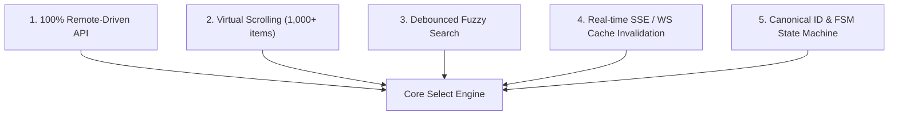
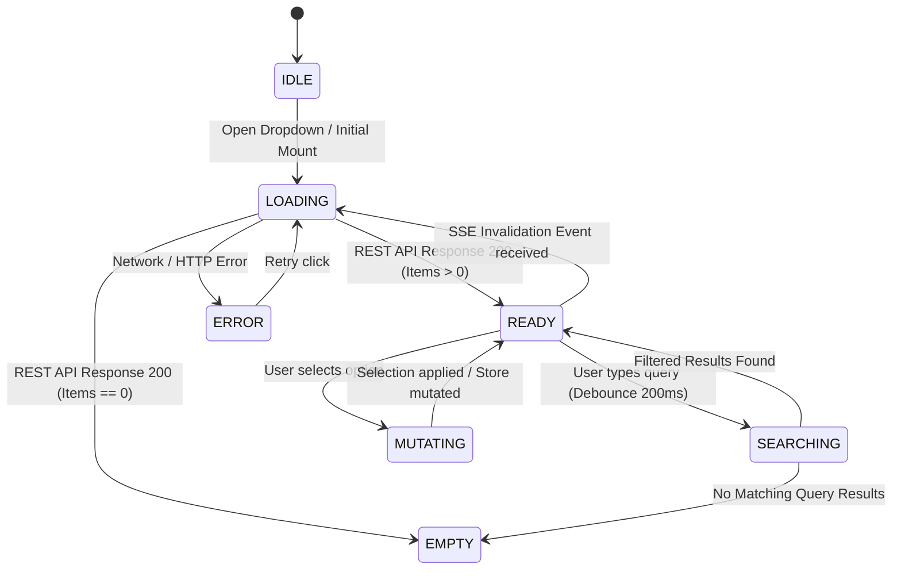
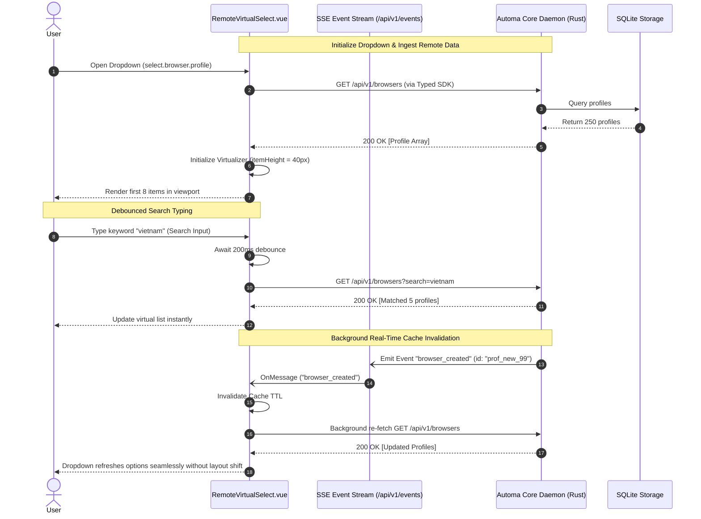
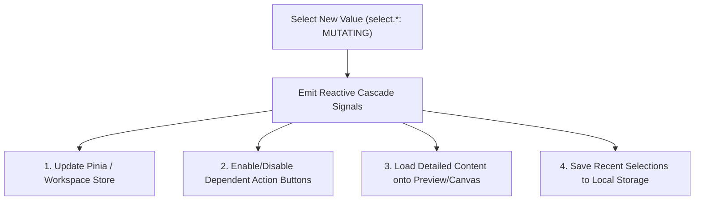

# 📜 SRS Select & Dropdown Business Logic: Event-Driven, Remote, Virtualized & Search Schema

---

## 🎯 1. Overview & Core Architectural Invariants

This document serves as the **Master Technical Specification (SRS)** for all Select / Dropdown / Combobox components across the Automa Ecosystem (**`apps/desk`**, **`apps/vsce`**, **`apps/webe`**).

Every Select component in the system **MUST** comply with 5 invariants:



---

### 🛡️ 5 Core Invariants

1. **100% Remote-Driven (Zero Hardcoded Options)**:
   - All selection collections (Browser Profiles, Workflows, Campaigns, Tables, Variables, Credentials) are loaded dynamically from **Automa Core REST API** (`/api/v1/...`) via `@automa/types/api`.
   - Hardcoding static data arrays in Vue templates is strictly prohibited.
2. **Virtual Scrolling Engine (Jank-Free 60 FPS UI)**:
   - Extensible collections (such as 500+ browser profiles, 1,000+ workflows) **must use Virtual Scrolling** (calculating `slice(start, end)` based on `itemHeightPx`, rendering only 8–10 DOM nodes at any time).
3. **Debounced Fuzzy Search**:
   - Integrated search input inside the dropdown.
   - Dual-mode support:
     * **Client-side Fuzzy**: For small collections (< 100 items).
     * **Remote Debounced (`200ms - 250ms`)**: Sends `?search=...` query param to the Core Daemon for large collections.
4. **Real-time SSE / WS Cache Invalidation**:
   - On receiving SSE events from the daemon (e.g. `browser_created`, `workflow_deleted`, `table_changed`), the Select component automatically invalidates cached data and re-fetches in the background without interrupting user focus.
5. **Canonical ID & FSM State Machine**:
   - Each dropdown is uniquely identified by a canonical **Select ID** (`select.domain.subdomain.target`).
   - Governed by a Finite State Machine: `IDLE` $\rightarrow$ `LOADING` $\rightarrow$ `READY` $\rightarrow$ `SEARCHING` $\rightarrow$ `EMPTY` $\rightarrow$ `ERROR` $\rightarrow$ `MUTATING`.

---

## 🔄 2. Select Lifecycle Finite State Machine (FSM)



### 🏷️ FSM State Definitions

| State | UI Description & Behavior |
|---|---|
| **`IDLE`** | Dropdown is closed or uninitialized. |
| **`LOADING`** | Fetching REST API via SDK. Displays skeleton loader or spinning indicator. |
| **`READY`** | Data cached and ready; virtual scroller initialized and responsive to arrow keys. |
| **`SEARCHING`** | User is typing query; debounce countdown active before filtering. |
| **`EMPTY`** | Collection is empty (no profiles/workflows found or query matches nothing). Displays empty state with "Create New" CTA. |
| **`ERROR`** | Network failure or daemon offline. Displays error banner with "Retry" action. |
| **`MUTATING`** | User made a selection; syncing with Pinia store or patching API. |

---

## 📊 3. Standardized Catalog of 11 Select Components

| # | Select ID (`select.*`) | Context Scope | Remote Endpoint | Virtualize | Search Mode | Debounce | SSE Invalidation Events |
|---|---|---|---|:---:|:---:|:---:|---|
| **1** | `select.browser.profile` | `WorkflowCanvas`, `StudioHeader` | `/api/v1/browsers` | **Yes** (40px) | Hybrid (Fuzzy) | 200ms | `browser_created`, `browser_deleted`, `browser_updated` |
| **2** | `select.storage.workflow` | `StudioHeader`, `CommandPalette` | `/api/v1/storage/workflows` | **Yes** (44px) | Hybrid (Remote) | 250ms | `workflow_created`, `workflow_updated`, `workflow_deleted` |
| **3** | `select.campaign.suite` | `CampaignMatrix` | `/api/v1/storage/campaigns` | **Yes** (40px) | Hybrid (Remote) | 200ms | `campaign_created`, `campaign_deleted` |
| **4** | `select.storage.table` | `StorageExplorer`, `ModalDialog` | `/api/v1/storage/tables` | **Yes** (38px) | Client Fuzzy | 150ms | `storage_table_changed` |
| **5** | `select.storage.variable` | `StorageExplorer`, `WorkflowCanvas` | `/api/v1/storage/variables` | **Yes** (38px) | Client Fuzzy | 150ms | `storage_variable_changed` |
| **6** | `select.storage.credential` | `StorageExplorer`, `WorkflowCanvas` | `/api/v1/storage/credentials` | **Yes** (38px) | Client Fuzzy | 150ms | `storage_credential_changed` |
| **7** | `select.browser.type` | `SettingsPanel` | `/api/v1/system/settings` | No (Locked: `chromium`) | Client Static | 0ms | `settings_updated` |
| **8** | `select.grid.matrix.columns` | `SettingsPanel`, `CampaignMatrix` | `/api/v1/system/settings` | No (9 items) | Client Static | 0ms | `settings_updated` |
| **9** | `select.grid.matrix.rows` | `SettingsPanel`, `CampaignMatrix` | `/api/v1/system/settings` | No (6 items) | Client Static | 0ms | `settings_updated` |
| **10** | `select.history.job_filter` | `HistoryLogs` | `/api/v1/history` | No (4 items) | Client Static | 0ms | `job_finished`, `job_status` |
| **11** | `select.linter.rule_category` | `WorkflowCanvas` | `/api/v1/lint` | No (4 items) | Client Static | 0ms | N/A |

---

## ⚡ 4. Event-Driven Reactive Flows (SSE & WS)



---

## 💻 5. Component Integration Recipes

### 📦 Example: Vue 3.5 Virtualized Remote Select Component (`RemoteSelect.vue`)

```vue
<script setup lang="ts" generic="T = unknown">
import { ref, computed, onMounted } from 'vue';
import { getSelectSchema, type SelectId, type SelectOption, type SelectFsmState } from '@automa/types';

const props = defineProps<{
  selectId: SelectId;
  modelValue?: string | number;
}>();

const emit = defineEmits<{
  (e: 'update:modelValue', val: string | number): void;
  (e: 'select', option: SelectOption<T>): void;
}>();

const schema = computed(() => getSelectSchema(props.selectId)!);
const state = ref<SelectFsmState>('IDLE');
const options = ref<SelectOption<T>[]>([]);
const searchQuery = ref('');
const scrollTop = ref(0);

// Virtualization parameters
const itemHeight = computed(() => schema.value.virtualization.itemHeightPx);
const visibleCount = computed(() => schema.value.virtualization.maxVisibleItems);

const filteredOptions = computed(() => {
  if (!searchQuery.value.trim()) return options.value;
  const q = searchQuery.value.toLowerCase();
  return options.value.filter((o) => o.label.toLowerCase().includes(q));
});

const totalHeight = computed(() => filteredOptions.value.length * itemHeight.value);
const startIndex = computed(() => Math.max(0, Math.floor(scrollTop.value / itemHeight.value) - 2));
const endIndex = computed(() => Math.min(filteredOptions.value.length, startIndex.value + visibleCount.value + 4));
const visibleSlice = computed(() => filteredOptions.value.slice(startIndex.value, endIndex.value));
const offsetY = computed(() => startIndex.value * itemHeight.value);

async function loadData() {
  state.value = 'LOADING';
  try {
    const res = await fetch(schema.value.remote.endpoint);
    const data = await res.json();
    options.value = schema.value.remote.mapResponseToOptions(data) as SelectOption<T>[];
    state.value = options.value.length ? 'READY' : 'EMPTY';
  } catch (err) {
    state.value = 'ERROR';
  }
}

onMounted(() => {
  loadData();
});
</script>

<template>
  <div class="remote-select-container" :data-testid="schema.presentation.dataTestId">
    <!-- Search Input -->
    <div v-if="schema.search.searchable" class="select-search-bar">
      <input
        v-model="searchQuery"
        type="text"
        :placeholder="schema.search.placeholder"
        class="select-search-input"
      />
    </div>

    <!-- Virtual Scroll Viewport -->
    <div
      class="virtual-viewport"
      :style="{ height: `${itemHeight * visibleCount}px` }"
      @scroll="scrollTop = ($event.target as HTMLElement).scrollTop"
    >
      <div class="virtual-spacer" :style="{ height: `${totalHeight}px` }">
        <div class="virtual-content" :style="{ transform: `translateY(${offsetY}px)` }">
          <div
            v-for="item in visibleSlice"
            :key="item.value"
            class="select-item"
            :style="{ height: `${itemHeight}px` }"
            @click="emit('update:modelValue', item.value); emit('select', item)"
          >
            <span class="item-label">{{ item.label }}</span>
            <span v-if="item.badge" :class="`badge badge-${item.badge.variant || 'default'}`">{{ item.badge.text }}</span>
          </div>
        </div>
      </div>
    </div>
  </div>
</template>
```

---

## ♿ 6. Accessibility & Keyboard Navigation

Every Select component **MUST** support full WAI-ARIA keyboard navigation:
- **`Enter` / `Space`**: Open dropdown or pick the focused item.
- **`ArrowDown`**: Move to the next item in the virtual index.
- **`ArrowUp`**: Move to the previous item.
- **`Escape`**: Close dropdown and return focus to trigger element.
- **`Home` / `End`**: Jump to the first or last item in collection.
- **`Tab`**: Close dropdown and move focus to the next interactive element.

---

## ⚡ 7. Cross-Component Reflection Graph & Side-Effects

When a value is selected on any Select Component (`select.*`), this mutation **MUST** trigger reactive side-effects to synchronize across views and stores:



### 📋 Cross-Reflection Matrix for Select Dropdowns

| Select Dropdown (`select.*`) | Key Mutation Event | Dependent Elements & Buttons | Required Reactive Side-Effect |
|---|---|---|---|
| `select.browser.profile` | New Profile ID selected | `btn.workflow.run`, `btn.browser.launch`, `StudioHeader.vue`, Browser Status Card | Updates `activeBrowserId` in Pinia store, displays profile icon & timezone on header, enables Run button. |
| `select.storage.workflow` | New Workflow ID selected | VueFlow Canvas, `btn.workflow.run`, `btn.workflow.save`, Breadcrumbs | Loads workflow AST JSON onto canvas, resets dirty state, triggers AST linter engine. |
| `select.campaign.suite` | New Campaign ID selected | `MatrixGrid.vue`, `btn.campaign.matrix.run`, `btn.campaign.abort` | Loads grid matrix slot configurations, browser assignments, enables Execute Campaign button. |
| `select.storage.table` | New Table ID selected | `TableView.vue`, Table Column Inspector, dynamic pagination bar | Calls GET `/api/v1/storage/tables/{id}/rows` to fetch first 10 rows, renders column definitions. |
| `select.storage.variable` | Variable Key selected | Variable Expression Preview (`{{variables.KEY}}`), JSON Editor | Inserts variable key at cursor position in block editor, displays current value preview. |
| `select.storage.credential` | Secret Key selected | Credential Expression Preview (`{{secrets.KEY}}`), Block Config | Inserts encrypted credential reference, obscures plaintext value (Zero-Leak Cryptography). |
| `select.browser.type` | Locked Executable (Phase 1: `chromium`) | `useBrowserWaterfall.ts`, Settings Form, Waterfall Resolver Modal | Locks value to 'chromium', eliminating host scanner overhead (Zero-Host Invariant). |
| `select.grid.matrix.columns` | Matrix column count updated (1..12) | `MatrixGrid.vue`, Desktop Slot Tile Layout CSS Grid | Re-computes `slot_w` and `slot_h`, updates CSS grid template columns in real-time. |
| `select.grid.matrix.rows` | Matrix row count updated (1..8) | `MatrixGrid.vue`, Desktop Slot Tile Layout CSS Grid | Re-computes `slot_h`, updates CSS grid template rows in real-time. |
| `select.history.job_filter` | Filter mode changed (`all`/`running`/`completed`/`failed`) | `HistoryView.vue`, `LogsTreeDataProvider.ts` | Filters job history list instantaneously by execution status, updates pagination. |
| `select.linter.rule_category` | Diagnostics scope changed (`all`/`workflow`/`campaign`/`browser`) | Linter Diagnostics Panel, Node Warning Badges | Filters linter diagnostic issues rendered in problems panel and canvas badges. |

---

## 🔍 8. Agent Cross-Checking Protocol

When reviewing or integrating a Select Component, subagents **MUST** follow 3 verification steps:
1. **Binding Verification**: Confirm `select.*` fetches data from the exact OpenAPI endpoint defined in the catalog.
2. **Side-Effect Cascade Check**: Consult the **Cross-Reflection Matrix (Section 7)** to confirm that picking an item toggles the appropriate buttons (`btn.*`) and store states.
3. **Cache & SSE Invalidation Audit**: Verify or simulate the associated SSE event (e.g. `browser_created` for `select.browser.profile`) to ensure automatic refetch without losing the active selection.
