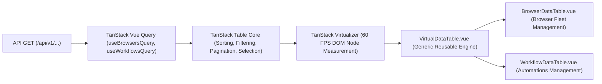

# 🎨 SRS Horizontal UI Components: Design System Architecture & Atomic Shadcn-Vue

---

## 🏛️ 1. Architecture Overview & Objectives

The user interface of the Automa Ecosystem is standardized around a **3-Tier Decoupled Design System** built on **Shadcn-Vue** and **Radix-Vue**, centralized in the [`@automa/ui`](../../packages/ui) package.

```mermaid
flowchart TD
    subgraph Layer0 ["TIER 0: THEME TOKENS & PLATFORM BRIDGE (tokens.css)"]
        Tokens["--background: var(--vscode-sideBar-background, #ffffff)
        --foreground: var(--vscode-foreground, #0f172a)
        --primary: var(--vscode-button-background, #2563eb)
        --primary-foreground: var(--vscode-button-foreground, #ffffff)
        --destructive: var(--vscode-errorForeground, #ef4444)
        --border: var(--vscode-panel-border, #e2e8f0)
        --muted: var(--vscode-editor-background, #f8fafc)
        --accent: var(--vscode-list-hoverBackground, rgba(0,0,0,0.04))"]
    end

    subgraph Layer1 ["TIER 1: PURE SHADCN PRIMITIVES (packages/ui/src/components/ui/)"]
        Button["Button (bg-primary text-primary-foreground ...)"]
        Badge["Badge (bg-primary / bg-destructive / border-border ...)"]
        Dialog["Dialog (bg-background border-border ...)"]
        Sheet["Sheet (bg-background border-border ...)"]
        Card["Card (bg-card text-card-foreground ...)"]
        Table["Table (border-border text-foreground ...)"]
        Tabs["Tabs (bg-muted text-muted-foreground ...)"]
        Dropdown["DropdownMenu (bg-popover border-border ...)"]
        OtherUI["Popover, Tooltip, Separator, Skeleton, Switch, Checkbox, ScrollArea..."]
    end

    subgraph Layer2 ["TIER 2: DOMAIN COMPOSITE COMPONENTS"]
        AutomaBtn["AutomaButton.vue (Wrap Button + FSM Engine 7-State + btn.*)"]
        RemoteSelect["RemoteVirtualSelect.vue (Wrap Popover + TanStack Virtual + select.*)"]
        ConfirmModal["ConfirmationModal.vue (Wrap AlertDialog)"]
        ConsoleDrawer["ExecutionConsoleDrawer.vue (Wrap Sheet + Virtual Logs)"]
    end

    subgraph Consumers ["ECOSYSTEM CONSUMERS"]
        Desk["apps/desk (Desktop Tauri v2)"]
        VSCE["apps/vsce (VS Code Extension Webview)"]
        WebE["apps/webe (Web Extension Canvas)"]
    end

    Layer0 --> Layer1 --> Layer2 --> Consumers
```

---

## 💎 2. Core Architectural Invariants

### Invariant 1: Theme Variable Inversion
* Atomic Vue primitives (`src/components/ui/`) **MUST retain 100% standardized Shadcn/Tailwind classes** (`bg-primary`, `text-primary-foreground`, `border-border`, `bg-card`, `bg-muted`...).
* **Strictly Prohibited**: Hardcoded hex color literals or ad-hoc `bg-[var(--automa-...)]` classes directly inside component Vue templates.
* Cross-platform adaptation (VS Code 100+ themes, Desktop Dark/Light, Web Extension) is resolved entirely at the **CSS Variables** tier in [`packages/ui/src/styles/tokens.css`](../../packages/ui/src/styles/tokens.css).

### Invariant 2: Internal Component Ownership
* All 19 atomic components are standardized and owned directly within `@automa/ui`.
* Components are maintained and extended directly under `packages/ui/src/components/ui/` alongside OKLCH tokens in `packages/ui/src/tokens.css`.

### Invariant 3: Zero Duplicate Mirror in Source Control
* Raw mirror folders (`upstream-shadcn/`) are never committed to the repository.
* Source integrity is enforced through architectural linting and `pnpm run lint`.

---

## 🛠️ 3. Design System CLI Tooling

Standardized commands in root `package.json`:
* `pnpm run build`: Compiles all UI libraries and types.
* `pnpm run lint`: Runs Biome, ESLint, and scans for style technical debt (`scripts/lint-style-debt.mjs`).
* `pnpm run test`: Runs the full Vitest suite for `@automa/ui`.

---

## 📦 4. Standardized Catalog of 19 Atomic Components

| # | Component | Local Path | Role & System Integration |
|---|---|---|---|
| 1 | **button** | `src/components/ui/button/` | Atomic button primitive; foundational for `AutomaButton` and the FSM engine (`btn.*`). |
| 2 | **badge** | `src/components/ui/badge/` | Status badges (Success, Warning, Destructive, Info, Outline). |
| 3 | **dialog** | `src/components/ui/dialog/` | Standard modal dialog (Command Palette, Settings dialogs). |
| 4 | **alert-dialog** | `src/components/ui/alert-dialog/` | Critical action confirmation modal (`ConfirmationModal`). |
| 5 | **sheet** | `src/components/ui/sheet/` | 4-directional slide-over drawer (`ExecutionConsoleDrawer`, Block properties). |
| 6 | **popover** | `src/components/ui/popover/` | Floating popover container; foundational for `RemoteVirtualSelect`. |
| 7 | **tooltip** | `src/components/ui/tooltip/` | Contextual hints and keyboard shortcut tooltips. |
| 8 | **card** | `src/components/ui/card/` | Container cards for profile details, history trace, and workflow summaries. |
| 9 | **input** | `src/components/ui/input/` | Text input control with 2-way `v-model` binding. |
| 10 | **separator** | `src/components/ui/separator/` | WAI-ARIA compliant horizontal/vertical divider lines. |
| 11 | **skeleton** | `src/components/ui/skeleton/` | Pre-render loading placeholders with pulse animation. |
| 12 | **table** | `src/components/ui/table/` | Multi-column data table (SQLite Tables explorer, Matrix slots). |
| 13 | **tabs** | `src/components/ui/tabs/` | Tab navigation (Tables / Variables / Credentials). |
| 14 | **switch** | `src/components/ui/switch/` | Boolean toggle switch (Anti-detect features, Dark mode toggle). |
| 15 | **dropdown-menu** | `src/components/ui/dropdown-menu/` | Multi-level context menu (Action dropdowns, Context menus). |
| 16 | **checkbox** | `src/components/ui/checkbox/` | Multi-selection checkboxes in list views. |
| 17 | **scroll-area** | `src/components/ui/scroll-area/` | Smooth virtualized scrolling viewport. |
| 18 | **avatar** | `src/components/ui/avatar/` | User avatar or browser profile icon. |
| 19 | **accordion** | `src/components/ui/accordion/` | Multi-tier collapsible content (Workflow parameters, Help docs). |

---

## 📊 5. Virtualized Data Table & Pagination System (TanStack Table & Virtual Scroll)

Packaged inside `@automa/ui`, combining `@tanstack/vue-table` + `@tanstack/vue-virtual` + Shadcn UI `Table` primitives to serve large datasets with 60 FPS performance:

### 1. `VirtualDataTable.vue` (Generic Engine)
* **Features**: Debounced search, multi-column sorting (`ArrowUp`, `ArrowDown`, `ArrowUpDown`), dual pagination (local client-side slicing or server-side `/api/v1/...` query params), batch row selection, and virtualized scrolling (`translateY` node measurement).
* **Custom Slots**: `#toolbar`, `#empty`, `#cell-[columnId]`, `#header-[columnId]`.

### 2. `BrowserDataTable.vue` (Browser Fleet Table)
* **Integration**: `useBrowsersQuery`, `useStartBrowserMutation`, `useStopBrowserMutation`, `useDeleteBrowserMutation`, `useBrowserStore`.
* **Columns**: Checkbox (batch actions), Status (Online pulsing badge / Offline), Profile Name & ID, Engine (Chromium / Chrome / Edge / Brave), Proxy Configuration (Server or Direct), Quick Actions (Launch `btn.browser.launch`, Stop, Delete `btn.browser.delete`).
* **Filters**: Quick status tabs (All, Online, Offline), Name/ID search input.

### 3. `WorkflowDataTable.vue` (Workflow Management Table)
* **Integration**: `useWorkflowsQuery`, `useDeleteWorkflowMutation`.
* **Columns**: Checkbox, Workflow Name & ID/Description, Version (`v1.30.0`), Block count, Last updated timestamp, Actions (Run `btn.workflow.run`, Edit, Export JSON, Delete).
* **Filters**: Workflow name/ID search, JSON Import button (`Import`), New Workflow button (`+ New Workflow`).

---

## 🔗 6. Cross-SRS Matrix Links

* [**SRS Button Business Logic & Event-Driven (`SRS_HORIZONTAL_BUTTONS.md`)**](./SRS_HORIZONTAL_BUTTONS.md): Extends `Button` primitive to implement the 37 `btn.*` FSM buttons.
* [**SRS Select & Dropdown Business Logic (`SRS_HORIZONTAL_SELECTS.md`)**](./SRS_HORIZONTAL_SELECTS.md): Extends `Popover` & `Input` to implement the 11 `select.*` virtualized selects.
* [**SRS Feature Stores & Reactive Hub (`SRS_HORIZONTAL_FEATURE_STORES.md`)**](./SRS_HORIZONTAL_FEATURE_STORES.md): Delivers reactive state and SSE hooks for `BrowserDataTable` and `WorkflowDataTable`.
* [**OpenAPI Integration Guide (`../OPENAPI_INTEGRATION_GUIDE.md`)**](../OPENAPI_INTEGRATION_GUIDE.md): Connects backend daemon endpoints into `Table`, `Card`, and `Badge` presentation layers.
