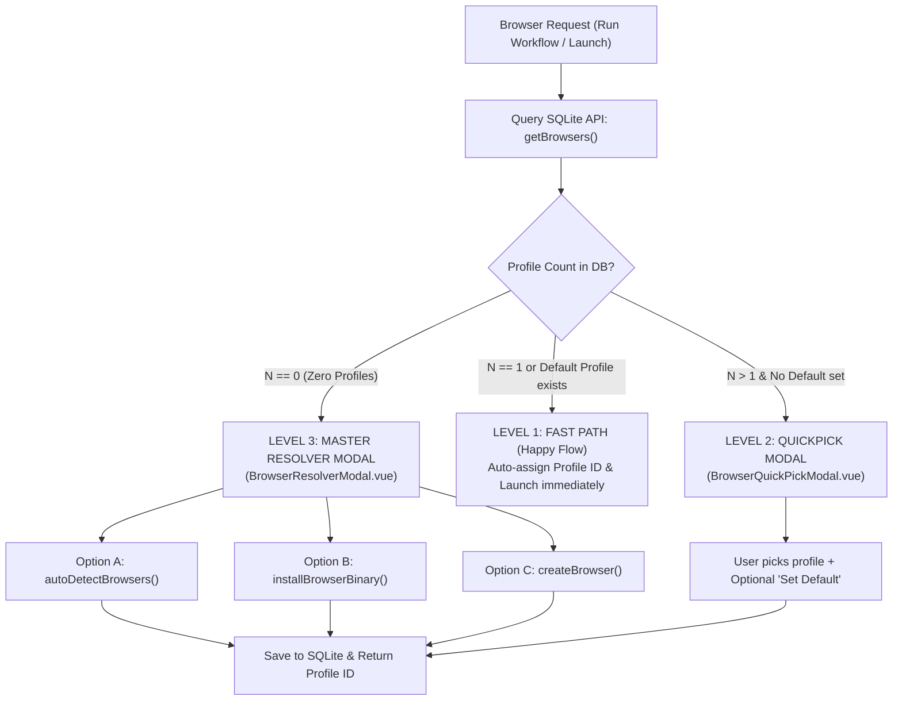

# 🌐 SRS Domain Specification: Menu Browsers (Anti-Detect Browser Fleet)

---

## 🎯 1. Scope & Objectives

The **Browsers** menu manages all virtual anti-detect browser profiles and Chromium execution sessions for the Automa Ecosystem:
- **`automa-desk`**: Provides a dedicated profile management interface (`BrowsersView.vue`), configures proxies, user-agents, and fingerprints, ensures a default profile (`autoDetectBrowsers`), and manages Chromium sessions.
- **`automa-vsce`**: Provides the `BROWSERS` sidebar panel (`automa.browsers`) and a management webview (`BrowserManagerView.vue`) with quick launch and stop capabilities.
- **`automa-webe:studio`**: Provides a quick profile selection modal (`BrowsersQuickModal.vue`) and self-healing waterfall resolution.
- **Phase 1 Standard (Zero-Host Invariant)**: The entire ecosystem relies exclusively on **a single standalone managed Chromium executable** (Playwright model). Scanning arbitrary host binaries is strictly prohibited to avoid environment drift and fingerprint leaks.

---

## 🌳 2. UI/UX Layout & Component Tree

```text
BrowsersView.vue (or BrowserManagerView.vue in VS Code)
├── Header Bar
│   ├── Search Input (Debounced 150ms)
│   ├── Filter Dropdown (select.browser.status: All / Online / Offline)
│   ├── btn.browser.autodetect (Ensure default Chromium profile)
│   ├── btn.browser.download (Download portable Chromium)
│   ├── btn.browser.create (Create new virtual profile)
│   └── btn.browser.killall (Emergency kill-all sessions)
├── Browser Profiles Grid / List
│   └── Browser Card (Per profile)
│       ├── Status Indicator Badge (Green: Online / Gray: Offline)
│       ├── Profile Name & Browser Type (Locked: Chromium)
│       ├── Proxy Tag & Fingerprint Summary
│       ├── Default Star Toggle (btn.browser.setdefault)
│       ├── btn.browser.launch / btn.browser.stop (Launch / Stop session)
│       ├── btn.browser.edit (Edit proxy and headers)
│       └── btn.browser.delete (Delete profile)
└── Modals:
    ├── CreateEditBrowserModal.vue (Configuration form)
    └── BrowserResolverModal.vue (3-tier self-healing waterfall)
```

---

## ⚡ 3. Button Catalog in Browsers Menu

| Button ID | UI Label | Icon | Supported FSM States | Target Action & Endpoint | `data-testid` |
|---|---|---|---|---|---|
| `btn.browser.launch` | Launch Browser | `ExternalLink` | `IDLE`, `DISPATCHING` | Calls `startBrowser()` to open Chromium | `btn-launch-browser` |
| `btn.browser.stop` | Stop Browser | `Square` | `ONLINE` | Calls `stopBrowserSession()` to close instance | `btn-stop-browser` |
| `btn.browser.killall` | Kill All Sessions | `Flame` | `IDLE`, `ONLINE` | Calls `killAllBrowsers()` to terminate all | `btn-kill-all-browsers` |
| `btn.browser.create` | New Profile | `Plus` | `IDLE` | Opens creation modal `createBrowser()` | `btn-create-browser` |
| `btn.browser.edit` | Edit Profile | `Edit` | `IDLE` | Opens editing form `updateBrowser()` | `btn-edit-browser` |
| `btn.browser.delete` | Delete Profile | `Trash2` | `IDLE` | Removes profile `deleteBrowser()` from SQLite | `btn-delete-browser` |
| `btn.browser.autodetect` | Ensure Default | `Search` | `IDLE`, `VALIDATING` | Calls `autoDetectBrowsers()` to verify Default Chromium | `btn-autodetect-browsers` |
| `btn.browser.download` | Download Binary | `Download` | `IDLE`, `DISPATCHING` | Calls `installBrowserBinary()` to fetch Chromium | `btn-download-browser-binary` |
| `btn.browser.setdefault`| Set Default | `Star` | `IDLE` | Designates global default profile in settings | `btn-set-default-browser` |

---

## 📜 4. Select Dropdowns in Browsers Menu

| Select ID | Dropdown Label | Remote Data Source | Virtualization & Debounce | Reactive Selection Side-Effect | `data-testid` |
|---|---|---|---|---|---|
| `select.browser.profile` | Filter Profiles | `GET /api/v1/browsers` | Virtualized 1000+, Debounce 150ms | Filters displayed profile cards in UI | `select-browser-profile` |
| `select.browser.status` | Filter Status | Static Union (`all`, `online`, `offline`) | No virtualization | Updates list status filter | `select-browser-status` |
| `select.browser.proxy` | Select Proxy Config | `GET /api/v1/storage/variables` | Virtualized 500+, Debounce 150ms | Populates proxy URL into profile form | `select-browser-proxy` |

---

## 🍍 5. Associated Pinia State Management (`useBrowserStore`)

The [`useBrowserStore`](../../packages/ui/src/stores/useBrowserStore.ts) store coordinates browser domain state:
- `browsers`: Array of profile objects loaded from SQLite (`BrowserResponse[]`).
- `selectedBrowserId`: Currently selected target profile ID.
- `onlineBrowserIds`: Array of profile IDs actively running in RAM.
- `waterfallResolution`: Binary path resolution state (`executablePath`, `isDetected`).
- `onlineCount`: Computed getter tracking running session count.
- `setBrowserOnline(id, isOnline)`: Action updating state immediately upon receiving SSE `browser_online`/`browser_offline` events.

---

## 🌐 6. API Endpoints & SSE Events Catalog

| Protocol | Endpoint / Event | Method | SDK Function | Business Description |
|---|---|:---:|---|---|
| **REST** | `/api/v1/browsers` | `GET` | `getBrowsers({ query: { limit, offset, search } })` | Retrieves paginated profiles from SQLite |
| **REST** | `/api/v1/browsers` | `POST` | `createBrowser()` | Creates a new browser profile |
| **REST** | `/api/v1/browsers/{id}` | `PUT` / `DELETE` | `updateBrowser()` / `deleteBrowser()` | Updates or deletes an existing profile |
| **REST** | `/api/v1/browsers/{id}/session` | `POST` | `startBrowser()` | Launches an isolated Chromium session |
| **REST** | `/api/v1/browsers/{id}/session` | `DELETE` | `stopBrowserSession()` | Closes an active Chromium session |
| **REST** | `/api/v1/browsers/sessions` | `DELETE` | `killAllBrowsers()` | Terminates all running Chromium sessions |
| **REST** | `/api/v1/browsers/auto-detect` | `POST` | `autoDetectBrowsers()` | Resolves managed Chromium executable |
| **SSE** | `/api/v1/events` | Stream | `globalSseClient` | Ingests `browser_created`, `browser_deleted`, `browser_online`, `browser_offline` |

---

## 🔄 7. 3-Tier Browser Resolution Waterfall



---

## 🛡️ 8. Quality Assurance & Agent Cross-Checklist

When auditing the Browsers Menu, verify:
1. [ ] 100% of interactive buttons include standardized `data-testid` attributes (`btn-launch-browser`, `btn-create-browser`, `btn-kill-all-browsers`).
2. [ ] Clicking `Launch` shifts the card state to `ONLINE` with a pulsing badge and toggles the action to `btn.browser.stop`.
3. [ ] When the Core Daemon emits `browser_online` or `browser_offline` via SSE, the UI status badges update without manual refresh.
4. [ ] The `auto-detect` endpoint locates standard binary paths accurately.
