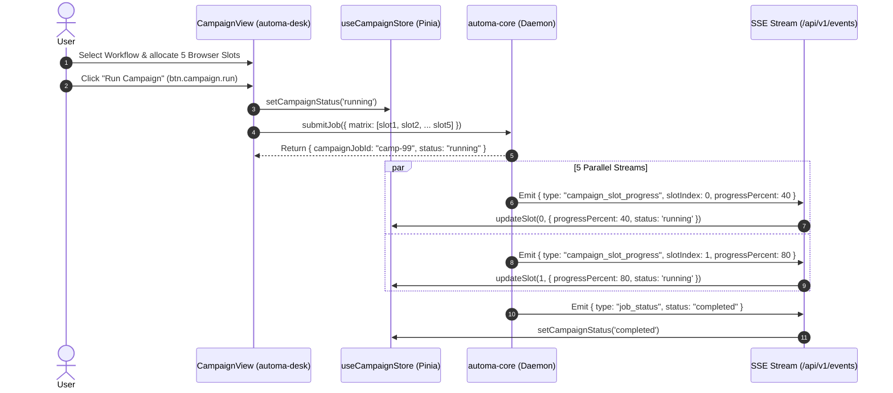

# 🚀 SRS Domain Specification: Menu Campaign (Campaign Matrix Fleet)

---

## 🎯 1. Scope & Objectives

The **Campaign** menu orchestrates large-scale automation campaigns (Matrix Automation Fleet) running across multiple independent browser profiles in parallel:
- **`automa-desk`**: Provides a resource allocation matrix grid (`CampaignView.vue`), configures concurrency limits (Slots), and monitors per-slot progress in real time.
- **`automa-vsce`**: Delivers a custom preview editor (`CampaignMatrixView.vue`) for `*.campaign.json` files within VS Code.
- **`automa-vault`**: Local on-disk workspace storage for campaign specifications.

---

## 🌳 2. UI/UX Layout & Component Tree

```text
CampaignView.vue (or CampaignMatrixView.vue in VS Code)
├── Campaign Header Toolbar
│   ├── Campaign Name & Status Badge (IDLE / RUNNING / ABORTED / COMPLETED)
│   ├── Target Workflow Selector (select.campaign.workflow)
│   ├── Concurrency Control (Slot Count Input: 1..32)
│   ├── btn.campaign.run (Run entire matrix)
│   ├── btn.campaign.abort (Emergency abort campaign)
│   └── btn.campaign.save (Persist campaign configuration)
├── Fleet Slots Allocation Grid
│   └── Campaign Slot Card (Per parallel worker)
│       ├── Slot Index (#1, #2, ... #N)
│       ├── Assigned Browser Selector (select.campaign.browser)
│       ├── Real-time Progress Bar (% progress & step count)
│       ├── Live Status Indicator (Idle / Running / Success / Error)
│       └── btn.campaign.slot.stop (Terminate individual slot)
└── Real-time Telemetry Progress Summary
    ├── Total Slots, Completed Count, Failed Count
    └── Overall Campaign Progress Gauge (%)
```

---

## ⚡ 3. Button Catalog in Campaign Menu

| Button ID | UI Label | Icon | Supported FSM States | Target Action & Endpoint | `data-testid` |
|---|---|---|---|---|---|
| `btn.campaign.run` | Run Campaign | `Play` | `IDLE`, `ABORTED` | Dispatches campaign matrix to daemon | `btn-run-campaign` |
| `btn.campaign.abort` | Abort Campaign | `Square` | `RUNNING` | Sends emergency abort signal | `btn-abort-campaign` |
| `btn.campaign.save` | Save Matrix | `Save` | `IDLE` | Persists `*.campaign.json` to SQLite | `btn-save-campaign` |
| `btn.campaign.slot.add` | Add Slot | `Plus` | `IDLE` | Appends a browser worker slot to matrix | `btn-add-campaign-slot` |
| `btn.campaign.slot.remove`| Remove Slot | `Trash2` | `IDLE` | Removes worker slot from matrix | `btn-remove-campaign-slot` |
| `btn.campaign.slot.stop` | Stop Slot | `XCircle` | `RUNNING` | Halts specific running slot | `btn-stop-campaign-slot` |

---

## 📜 4. Select Dropdowns in Campaign Menu

| Select ID | Dropdown Label | Remote Data Source | Virtualization & Debounce | Reactive Selection Side-Effect | `data-testid` |
|---|---|---|---|---|---|
| `select.campaign.workflow`| Select Target Workflow | `GET /api/v1/storage/workflows` | Virtualized 1000+, Debounce 150ms | Assigns base workflow for matrix dispatch | `select-campaign-workflow` |
| `select.campaign.browser` | Assign Browser to Slot | `GET /api/v1/browsers` | Virtualized 1000+, Debounce 150ms | Binds dedicated browser profile to slot | `select-campaign-browser` |

---

## 🍍 5. Associated Pinia State Management (`useCampaignStore`)

The [`useCampaignStore`](../../packages/ui/src/stores/useCampaignStore.ts) store coordinates campaign matrix execution:
- `campaignId`, `campaignName`: Campaign metadata identifiers.
- `activeSlots`: Array of worker slots (`slotIndex`, `browserId`, `workflowId`, `status`, `progressPercent`).
- `status`: Overall matrix status (`'idle' | 'running' | 'aborted' | 'completed'`).
- `updateSlot(index, patch)`: Modifies slot progress immediately upon receiving SSE `campaign_slot_progress` events.

---

## 🌐 6. API Endpoints & SSE Events Catalog

| Protocol | Endpoint / Event | Method | SDK Function | Business Description |
|---|---|:---:|---|---|
| **REST** | `/api/v1/storage/campaigns` | `GET` | `getCampaigns({ query: { limit, offset, search } })` | Retrieves paginated campaign definitions |
| **REST** | `/api/v1/storage/campaigns` | `POST` | `saveCampaign()` | Persists campaign matrix configuration |
| **REST** | `/api/v1/jobs` | `POST` | `submitJob()` | Dispatches parallel matrix execution |
| **SSE** | `/api/v1/events` | Stream | `globalSseClient` | Ingests `campaign_slot_progress`, `campaign_aborted` |

---

## 🔄 7. Multi-Threaded Matrix Dispatch Sequence



---

## 🛡️ 8. Quality Assurance & Agent Cross-Checklist

1. [ ] The matrix grid comfortably renders up to 32 parallel slots without UI stutter via Virtualization.
2. [ ] Slot progress percentage bars update smoothly upon receiving SSE `campaign_slot_progress` events.
3. [ ] Triggering `Abort Campaign` transitions 100% of running slots to `aborted` and closes associated browser sessions.
