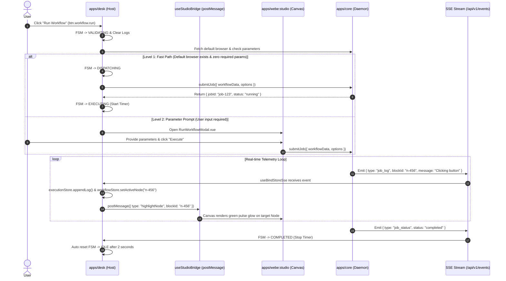

# 🎨 SRS Domain Specification: Menu Studio (Canvas & Workflow Editor)

---

## 🎯 1. Scope & Objectives

The **Studio** menu is the workflow orchestration and visual graph editor for the Automa Ecosystem:
- **`apps/webe:studio`**: Delivers a pure Web Visual Canvas Engine based on VueFlow, handling block drag-and-drop, edge connections, parameter configurations, and real-time AST linting.
- **`apps/desk`**: Embeds Studio Canvas via Iframe (`StudioCanvasEmbed.vue`), integrates a standardized Action Header (`StudioActionHeader.vue`), coordinates execution FSM (`useStudioExecution.ts`), and renders the real-time Console Logs drawer (`ExecutionConsole.vue`).
- **`apps/vsce`**: Embeds Studio Canvas via a Custom Text Editor Webview (`WorkflowEditorView.vue`) bound to `*.workflow.json` files.

---

## 🌳 2. UI/UX Component Tree

```text
StudioView.vue
├── StudioActionHeader.vue (Top Toolbar)
│   ├── Workflow Name & Version Badge
│   ├── btn.workflow.save (Save workflow)
│   ├── btn.workflow.lint (Verify AST schema)
│   ├── select.workflow.browser (Quick target browser selector)
│   └── btn.workflow.run / btn.workflow.stop (Run / Stop FSM)
├── StudioCanvasEmbed.vue (Center Graph Area - Iframe to apps/webe:studio)
│   ├── VueFlow Visual Canvas (WorkflowEditor.vue)
│   │   ├── Custom Blocks (BlockBasic, BlockGroup, BlockLoop, etc.)
│   │   └── Smart Connect & Output Handles
│   ├── Blocks Palette Drawer (Automation blocks catalog)
│   ├── Block Edit Drawer (WorkflowEditBlock.vue)
│   └── Modals:
│       ├── RunWorkflowModal.vue (Runtime parameter & browser selector)
│       ├── BrowsersQuickModal.vue (Quick profile manager)
│       └── StorageTablesModal.vue (SQLite table selector)
└── ExecutionConsole.vue (Bottom Collapsible Drawer)
    ├── FSM Status Badge (IDLE / VALIDATING / DISPATCHING / EXECUTING / COMPLETED / FAILED)
    ├── Execution Timer (mm:ss.S)
    ├── Telemetry Log Stream Filter (All / Info / Warn / Error)
    └── Clear Logs & Close Buttons
```

---

## ⚡ 3. Button Catalog in Studio Menu

| Button ID | UI Label | Icon / Shortcut | Supported FSM States | Target Action & Endpoint | `data-testid` |
|---|---|---|---|---|---|
| `btn.workflow.run` | Run Workflow | `Play` / `F5` | `IDLE`, `VALIDATING`, `DISPATCHING` | Triggers Waterfall resolver $\rightarrow$ `submitJob()` | `btn-run-workflow` |
| `btn.workflow.stop` | Stop Job | `Square` / `Shift+F5` | `EXECUTING`, `TERMINATING` | Sends cancellation `killJob()` or WS `KILL_JOB` | `btn-stop-workflow` |
| `btn.workflow.pause` | Pause Job | `Pause` | `EXECUTING` | Sends pause command via WebSocket `PAUSE_JOB` | `btn-pause-workflow` |
| `btn.workflow.resume` | Resume Job | `Play` | `PAUSED` | Sends resume command via WebSocket `RESUME_JOB` | `btn-resume-workflow` |
| `btn.workflow.save` | Save Workflow | `Save` / `Ctrl+S` | `IDLE`, `VALIDATING` | Updates storage via `saveWorkflow()` / SQLite | `btn-save-workflow` |
| `btn.workflow.export` | Export JSON | `Download` | `IDLE` | Exports active workflow as `.workflow.json` | `btn-export-workflow` |
| `btn.workflow.import` | Import File | `Upload` | `IDLE` | Reads `.workflow.json` from disk into Canvas | `btn-import-workflow` |
| `btn.workflow.lint` | Lint AST | `CheckCircle` | `IDLE`, `VALIDATING` | Invokes `lintWorkflow()` to detect loops and schema errors | `btn-lint-workflow` |
| `btn.workflow.format` | Auto Layout | `LayoutGrid` | `IDLE` | Arranges graph layout via Dagre | `btn-format-workflow` |
| `btn.workflow.undo` | Undo | `Undo2` / `Ctrl+Z` | `IDLE` | Reverts last action on canvas | `btn-undo-workflow` |
| `btn.workflow.redo` | Redo | `Redo2` / `Ctrl+Y` | `IDLE` | Reapplies reverted action | `btn-redo-workflow` |
| `btn.workflow.debug.step` | Step Over | `StepForward` / `F10`| `PAUSED` | Steps to next block in debugger mode | `btn-debug-step` |

---

## 📜 4. Select Dropdowns in Studio Menu

| Select ID | Dropdown Label | Remote Data Source | Virtualization & Debounce | Reactive Selection Side-Effect | `data-testid` |
|---|---|---|---|---|---|
| `select.workflow.browser` | Select Target Browser | `GET /api/v1/browsers` | Virtualized 1000+, Debounce 200ms | Sets `browserStore.selectedBrowserId` $\rightarrow$ Updates target for `btn.workflow.run` | `select-workflow-browser` |
| `select.workflow.table` | Select Storage Table | `GET /api/v1/storage/tables` | Virtualized 500+, Debounce 150ms | Populates table column metadata into `{{table.COL}}` suggestions | `select-workflow-table` |
| `select.workflow.variable` | Select Global Variable | `GET /api/v1/storage/variables` | Virtualized 1000+, Debounce 150ms | Auto-fills `{{variables.KEY}}` into block input fields | `select-workflow-variable` |

---

## 🍍 5. Associated Pinia State Management

The Studio menu interacts directly with 2 primary Domain Stores:
1. **`useWorkflowStore`**:
   - `workflow`: Workflow AST structure (`nodes`, `edges`, `settings`, `globalData`).
   - `isDirty`: Flag tracking unsaved edits.
   - `activeNodeId`: Currently executing node ID from SSE `job_log`, activating the pulse highlighter.
   - `breakpoints`: Array of node IDs pausing execution.
   - `lintIssues`: Array of warnings and errors from the AST linter.
2. **`useExecutionStore`**:
   - `fsmState`: Execution state machine (`IDLE` $\rightarrow$ `VALIDATING` $\rightarrow$ `DISPATCHING` $\rightarrow$ `EXECUTING` $\rightarrow$ `COMPLETED`).
   - `activeJobId`: Unique daemon-assigned job ID.
   - `logs`: Ring buffer storing real-time telemetry logs from SSE.
   - `isConsoleOpen`: Boolean toggle for console drawer visibility.

---

## 🌐 6. API Endpoints, SSE & WebSocket Catalog

| Protocol | Path / Channel | Method | SDK Function | Business Description |
|---|---|:---:|---|---|
| **REST** | `/api/v1/jobs` | `POST` | `submitJob()` | Dispatches workflow execution session to daemon |
| **REST** | `/api/v1/jobs/{id}` | `DELETE` | `killJob()` | Terminates active job execution immediately |
| **REST** | `/api/v1/lint` | `POST` | `lintWorkflow()` | Analyzes AST cycles and validation errors |
| **REST** | `/api/v1/storage/workflows` | `GET` / `POST` | `getWorkflow()` / `saveWorkflow()` | Retrieves or persists workflow definition in SQLite |
| **SSE** | `/api/v1/events` | Stream | `globalSseClient` | Subscribes to `job_log` (block progress) & `job_status` (lifecycle) |
| **WS** | `/api/v1/ws` | 2-Way | `wsClient` | Sends real-time control signals: `PAUSE_JOB`, `RESUME_JOB`, `KILL_JOB` |

---

## 🔄 7. Execution Sequence & FSM Workflow



---

## 🛡️ 8. Quality Assurance & Agent Cross-Checklist

When auditing the Studio Menu, verify the following 5 criteria:
1. [ ] 100% of Toolbar and Canvas action buttons define a valid `data-testid` matching `btn.workflow.*`.
2. [ ] The Browser Resolution Waterfall handles all 3 tiers (Fast path, QuickPick modal, Resolver modal).
3. [ ] When execution is active (`EXECUTING`), "Run" transforms into "Stop" (`btn.workflow.stop`) and "Save" is disabled.
4. [ ] Ingested SSE `job_log` events carrying `blockId` highlight the active node on Canvas and append to `ExecutionConsole`.
5. [ ] Raw `fetch()` calls are strictly prohibited; 100% of network traffic routes through `@automa/types/api`.
